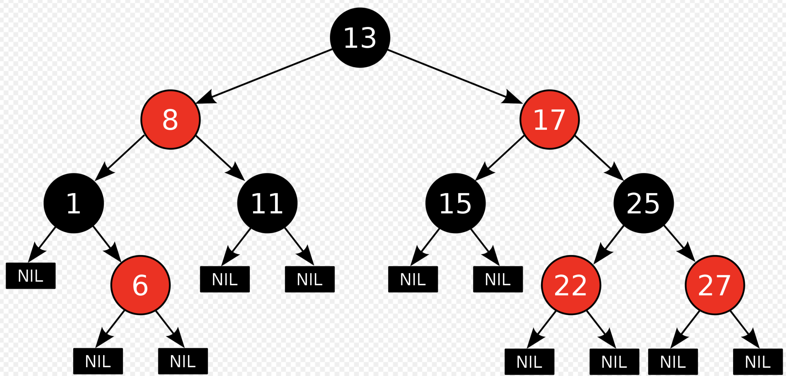

# Red–black tree

在计算机科学中，Red–black tree是一种自平衡二叉搜索树。每个节点利用一个额外的bit来代表其颜色，用于确保树在插入和删除期间保持近似平衡。

虽然红黑树不是完美的，但可以保证在O（log *n*）时间内进行搜索，其中*n*是树的节点数。插入和删除操作以及树的重新排列和重新着色也都在O（log *n*）时间中执行。

**Invented**：1972

**Invented by**：Rudolf Bayer

| **Algorithm** | **Average** | **Worst case** |
| ------------- | ----------- | -------------- |
| **Space**     | O(*n*)      | O(log *n*)     |
| **Search**    | O(log *n*)  | O(log *n*)     |
| **Insert**    | O(log *n*)  | O(log *n*)     |
| **Delete**    | O(log *n*)  | O(log *n*)     |

## 性质

1. 节点是红色或黑色
2. 根是黑色
3. 所有叶子都是黑色（叶子是NIL节点）
4. 每个红色节点必须有两个黑色的子节点
5. 从任一节点到其每个叶子的所有简单路径都包含相同数目的黑色节点。

以下是一个红黑树的示例

**情形1**:新节点N位于树的根上，没有父节点。在这种情形下，我们把它重绘为黑色以满足性质2。因为它在每个路径上对黑节点数目增加一，性质5符合。

**情形2**:新节点的父节点P是黑色，所以性质4没有失效（新节点是红色的）。在这种情形下，树仍是有效的。性质5也未受到威胁，尽管新节点N有两个黑色叶子子节点；但由于新节点N是红色，通过它的每个子节点的路径就都有同通过它所取代的黑色的叶子的路径同样数目的黑色节点，所以依然满足这个性质。

https://github.com/julycoding/The-Art-Of-Programming-By-July/blob/master/ebook/zh/03.01.md