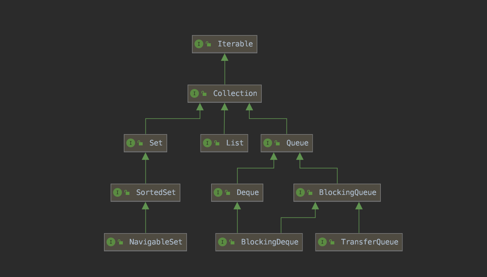
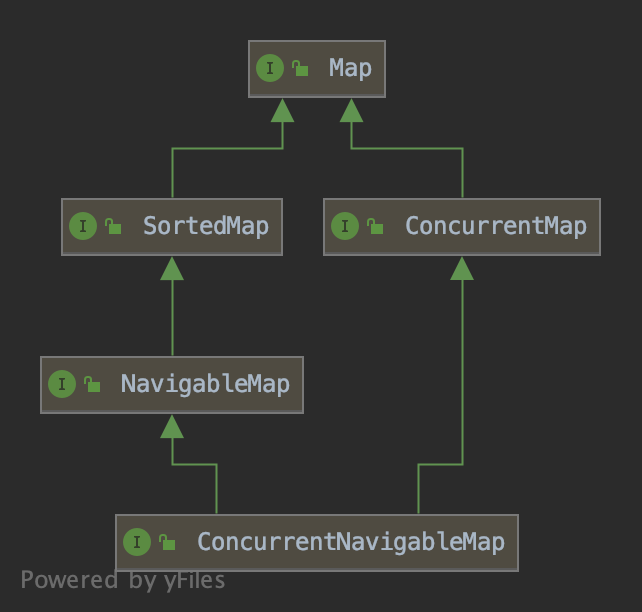

The *collection interfaces* are divided into two groups,  The most basic interface, `java.util.Collection`, has the following descendants:

+ java.util.Set
+ java.util.SortedSet
+ java.util.NavigableSet
+ java.util.Queue
+ java.util.concurrent.BlockingQueue
+ java.util.concurrent.TransferQueue
+ java.util.Deque
+ java.util.concurrent.BlockingDeque

The other collection interfaces are based on `java.util.Map` and are not true collections. 

+ java.util.SortedMap
+ java.util.NavigableMap
+ java.util.concurrent.ConcurrentMap
+ java.util.concurrent.ConcurrentNavigableMap

**List**

| Name                 | 线程安全 | 描述                |
| -------------------- | -------- | ------------------- |
| ArrayList            | No       | 基于数组的List      |
| LinkedList           | No       | 基于双向链表的List  |
| CopyOnWriteArrayList | Yes      | 线程安全的ArrayList |

**Map**

| Name                                           | 线程安全 | 是否有序 | 描述 |
| ---------------------------------------------- | -------- | -------- | ---- |
| [HashMap](2.Java/2.3Collection&Map/HashMap.md) | No       | -        | No   |
| LinkedHashMap                                  | No       | -        | -    |
| WeakHashMap                                    | No       | -        | -    |
| TreeMap                                        | No       | -        | Yes  |
| ConcurrentHashMap                              | Yes      | -        | -    |
| ConcurrentSkipListMap                          | Yes      | -        | -    |

**Set**

| Name                | 线程安全 | 描述 |
| ------------------- | -------- | ---- |
| HashSet             | -        | -    |
| LinkedHashSet       | -        | -    |
| CopyOnWriteArraySet | -        | -    |
| ConcurrentSkipSet   | -        | -    |

**Queue**

| Name                  | 线程安全 | 描述 |
| --------------------- | -------- | ---- |
| PriorityQueue         | -        | -    |
| ArrayBlockingQueue    | -        | -    |
| LinkedBlockingQueue   | -        | -    |
| SynchronousQueue      | -        | -    |
| PriorityBlockingQueue | -        | -    |
| LinkedTransferQueue   | -        | -    |
| DelayQueue            | -        | -    |
| ConcurrentLinkedQueue | -        | -    |

**Deque**

| Name                  | 线程安全 | 描述 |
| --------------------- | -------- | ---- |
| ArrayDeque            | -        | -    |
| LinkedBlockingDeque   | -        | -    |
| ConcurrentLinkedDeque | -        | --   |
| LinkedList            | -        | -    |