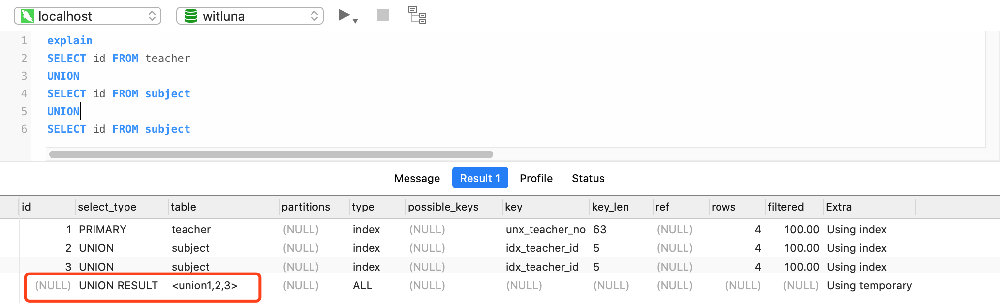
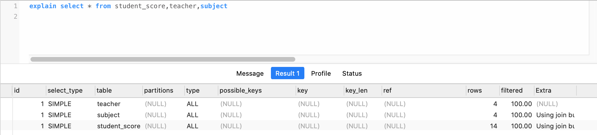
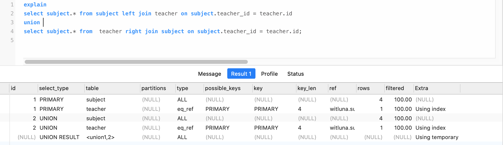
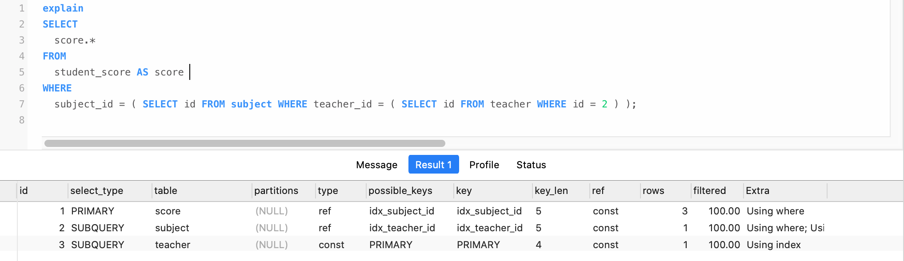

# MySQL Explain

### Explain的用途

1. 表的读取顺序如何
2. 数据读取操作有哪些操作类型
3. 哪些索引可以使用
4. 哪些索引被实际使用
5. 表之间是如何引用
6. 每张表有多少行被优化器查询

### Explain输出字段


1. **id**：select查询的序列号，包含一组数字，表示查询中执行select子句或操作表的顺序
2. **select_type**：查询类型
3. **table** ：正在访问哪个表
4. **partitions**：匹配的分区
5. **type**：访问的类型
6. **possible_keys**：显示可能应用在这张表中的索引，一个或多个，但不一定实际使用到
7. **key**：实际使用到的索引，如果为NULL，则没有使用索引
8. **key_len**：表示索引中使用的字节数，可通过该列计算查询中使用的索引的长度
9. **ref**：显示索引的哪一列被使用了，如果可能的话，是一个常数，哪些列或常量被用于查找索引列上的值
10. **rows**：根据表统计信息及索引选用情况，大致估算出找到所需的记录所需读取的行数
11. **filtered**：查询的表行占表的百分比
12. **Extra**：包含不适合在其它列中显示但十分重要的额外信息

### id字段

The SELECT identifier. This is the sequential number of the SELECT within the query. The value can be NULL if the row refers to the union result of other rows. In this case, the table column shows a value like <unionM,N> to indicate that the row refers to the union of the rows with id values of M and N.

#### id is NULL


执行顺序从上至下



#### id相同

```
执行顺序从上至下，并且数据量小的Table会优先执行
```




#### id出现相同

```
id如果相同，可以认为是一组，从上往下顺序执行
在所有组中，id值越大，优先级越高，越先执行
```



#### id不相同

```
如果是子查询，id的序号会递增，id的值越大优先级越高，越先被执行
```



### 附 表结构

```mysql
DROP TABLE
IF
	EXISTS `subject`;
CREATE TABLE SUBJECT (
	id INT ( 10 ) auto_increment,
	NAME VARCHAR ( 20 ),
	teacher_id INT ( 10 ),
	PRIMARY KEY ( id ),
	INDEX idx_teacher_id ( teacher_id ) 
);-- 学科表

DROP TABLE
IF
	EXISTS `teacher`;
CREATE TABLE teacher (
	id INT ( 10 ) auto_increment,
	NAME VARCHAR ( 20 ),
	teacher_no VARCHAR ( 20 ),
	PRIMARY KEY ( id ),
	UNIQUE INDEX unx_teacher_no ( teacher_no ( 20 ) ) 
);-- 教师表

DROP TABLE
IF
	EXISTS `student`;
CREATE TABLE student (
	id INT ( 10 ) auto_increment,
	NAME VARCHAR ( 20 ),
	student_no VARCHAR ( 20 ),
	PRIMARY KEY ( id ),
	UNIQUE INDEX unx_student_no ( student_no ( 20 ) ) 
);-- 学生表
DROP TABLE
IF
	EXISTS `student_score`;
CREATE TABLE student_score (
	id INT ( 10 ) auto_increment,
	student_id INT ( 10 ),
	subject_id INT ( 10 ),
	score INT ( 10 ),
	PRIMARY KEY ( id ),
	INDEX idx_student_id ( student_id ),
	INDEX idx_subject_id ( subject_id ) 
);-- 学生成绩表

ALTER TABLE teacher ADD INDEX idx_name ( NAME ( 20 ) );-- 教师表增加名字普通索引


INSERT INTO student ( NAME, student_no )
VALUES
	( 'zhangsan', '20200001' ),
	( 'lisi', '20200002' ),
	( 'yan', '20200003' ),
	( 'dede', '20200004' );
INSERT INTO teacher ( NAME, teacher_no )
VALUES
	( 'wangsi', 'T2010001' ),
	( 'sunsi', 'T2010002' ),
	( 'jiangsi', 'T2010003' ),
	( 'zhousi', 'T2010004' );
INSERT INTO SUBJECT ( NAME, teacher_id )
VALUES
	( 'math', 1 ),
	( 'Chinese', 2 ),
	( 'English', 3 ),
	( 'history', 4 );
INSERT INTO student_score ( student_id, subject_id, score )
VALUES
	( 1, 1, 90 ),
	( 1, 2, 60 ),
	( 1, 3, 80 ),
	( 1, 4, 100 ),
	( 2, 4, 60 ),
	( 2, 3, 50 ),
	( 2, 2, 80 ),
	( 2, 1, 90 ),
	( 3, 1, 90 ),
	( 3, 4, 100 ),
	( 4, 1, 40 ),
	( 4, 2, 80 ),
	( 4, 3, 80 ),
	( 4, 5, 100 );
```

https://segmentfault.com/a/1190000021458117?utm_source=tag-newest