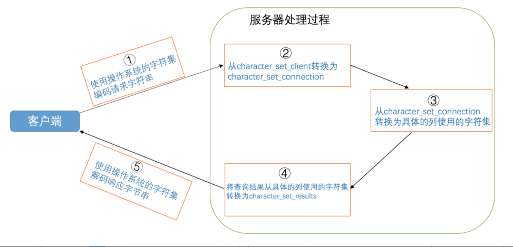

查询缓存：不推荐使用查询缓存，在MySQL 8.0中删除

# 三、启动选项和配置文件

如果你用过手机，你的手机上一定有一个设置的功能，你可以选择设置手机的来电铃声、设置音量大小、设置解锁密码等等。假如没有这些设置功能，我们的生活将置于尴尬的境地，比如在图书馆里无法把手机设置为静音，无法把流量开关关掉以节省流量，在别人得知解锁密码后无法更改密码～ `MySQL`的服务器程序和客户端程序也有很多设置项，比如对于`MySQL`服务器程序，我们可以指定诸如允许同时连入的客户端数量、客户端和服务器通信方式、表的默认存储引擎、查询缓存的大小吧啦吧啦的设置项。对于`MySQL`客户端程序，我们之前已经见识过了，可以指定需要连接的服务器程序所在主机的主机名或IP地址、用户名及密码等信息。

这些设置项一般都有各自的默认值，比方说服务器允许同时连入的客户端的默认数量是`151`，表的默认存储引擎是`InnoDB`，我们可以在程序启动的时候去修改这些默认值，对于这种在程序启动时指定的设置项也称之为启动选项（startup options），这些选项控制着程序启动后的行为。在`MySQL`安装目录下的`bin`目录中的各种可执行文件，不论是服务器相关的程序（比如`mysqld`、`mysqld_safe`）还是客户端相关的程序（比如`mysql`、`mysqladmin`），在启动的时候基本都可以指定启动参数。这些启动参数可以放在命令行中指定，也可以把它们放在配置文件中指定。下边我们会以`mysqld`为例，来详细唠叨指定启动选项的格式。需要注意的一点是，我们现在要唠叨的是设置启动选项的方式，下边出现的启动选项不论大家认不认识，先不用去纠结每个选项具体的作用是啥，之后我们会对一些重要的启动选项详细唠叨。

#### 在命令行上使用选项

如果我们在启动客户端程序时在`-h`参数后边紧跟服务器的IP地址，这就意味着客户端和服务器之间需要通过`TCP/IP`网络进行通信。因为我的客户端程序和服务器程序都装在一台计算机上，所以在使用客户端程序连接服务器程序时指定的主机名是`127.0.0.1`的情况下，客户端进程和服务器进程之间会使用`TCP/IP`网络进行通信。如果我们在启动服务器程序的时候就禁止各客户端使用`TCP/IP`网络进行通信，可以在启动服务器程序的命令行里添加`skip-networking`启动选项，就像这样：

```
mysqld --skip-networking
```

可以看到，我们在命令行中指定启动选项时需要在选项名前加上`--`前缀。另外，如果选项名是由多个单词构成的，它们之间可以由短划线`-`连接起来，也可以使用下划线`_`连接起来，也就是说`skip-networking`和`skip_networking`表示的含义是相同的。所以上边的写法与下边的写法是等价的：

```
mysqld --skip_networking
```

在按照上述命令启动服务器程序后，如果我们再使用`mysql`来启动客户端程序时，再把服务器主机名指定为`127.0.0.1`（IP地址的形式）的话会显示连接失败：

```
 mysql -h127.0.0.1 -uroot -p
Enter password:

ERROR 2003 (HY000): Can't connect to MySQL server on '127.0.0.1' (61)
```

这就意味着我们指定的启动选项`skip-networking`生效了！

再举一个例子，我们前边说过如果在创建表的语句中没有显式指定表的存储引擎的话，那就会默认使用`InnoDB`作为表的存储引擎。如果我们想改变表的默认存储引擎的话，可以这样写启动服务器的命令行：

```
mysqld --default-storage-engine=MyISAM
```

我们现在就已经把表的默认存储引擎改为`MyISAM`了，在客户端程序连接到服务器程序后试着创建一个表：

```
mysql> CREATE TABLE sys_var_demo(
    ->     i INT
    -> );
Query OK, 0 rows affected (0.02 sec)
```

这个定义语句中我们并没有明确指定表的存储引擎，创建成功后再看一下这个表的结构：

```
mysql> SHOW CREATE TABLE sys_var_demo\G
*************************** 1. row ***************************
       Table: sys_var_demo
Create Table: CREATE TABLE `sys_var_demo` (
  `i` int(11) DEFAULT NULL
) ENGINE=MyISAM DEFAULT CHARSET=utf8
1 row in set (0.01 sec)
```

可以看到该表的存储引擎已经是`MyISAM`了，说明启动选项`default-storage-engine`生效了。

所以在启动服务器程序的命令行后边指定启动选项的通用格式就是这样的：

```
--启动选项1[=值1] --启动选项2[=值2] ... --启动选项n[=值n]
```

也就是说我们可以将各个启动选项写到一行中，各个启动选项之间使用空白字符隔开，在每一个启动选项名称前边添加`--`。对于不需要值的启动选项，比方说`skip-networking`，它们就不需要指定对应的值。对于需要指定值的启动选项，比如`default-storage-engine`我们在指定这个设置项的时候需要显式的指定它的值，比方说`InnoDB`、`MyISAM`啦什么的～ 在命令行上指定有值的启动选项时需要注意，选项名、=、选项值之间不可以有空白字符，比如写成下边这样就是不正确的：

```
mysqld --default-storage-engine = MyISAM
```

每个MySQL程序都有许多不同的选项。大多数程序提供了一个--help选项，你可以查看该程序支持的全部启动选项以及它们的默认值。例如，使用`mysql --help`可以看到`mysql`程序支持的启动选项，`mysqld_safe --help`可以看到`mysqld_safe`程序支持的启动选项。查看`mysqld`支持的启动选项有些特别，需要使用`mysqld --verbose --help`。

##### 选项的长形式和短形式

我们前边提到的`skip-networking`、`default-storage-engine`称之为长形式的选项（因为它们很长），设计`MySQL`的大叔为了我们使用的方便，对于一些常用的选项提供了短形式，我们列举一些具有短形式的启动选项来瞅瞅（`MySQL`支持的短形式选项太多了，全列出来会刷屏的）：

|    长形式    | 短形式 | 含义     |
| :----------: | :----: | :------- |
|   `--host`   |  `-h`  | 主机名   |
|   `--user`   |  `-u`  | 用户名   |
| `--password` |  `-p`  | 密码     |
|   `--port`   |  `-P`  | 端口     |
| `--version`  |  `-V`  | 版本信息 |


短形式的选项名只有一个字母，与使用长形式选项时需要在选项名前加两个短划线`--`不同的是，使用短形式选项时在选项名前只加一个短划线`-`前缀。有一些短形式的选项我们之前已经接触过了，比方说我们在启动服务器程序时指定监听的端口号：

```
mysqld -P3307
```

使用短形式指定启动选项时，选项名和选项值之间可以没有间隙，或者用空白字符隔开（`-p`选项有些特殊，`-p`和密码值之间不能有空白字符），也就是说上边的命令形式和下边的是等价的：

```
mysqld -P 3307
```

另外，选项名是区分大小写的，比如`-p`和`-P`选项拥有完全不同的含义，大家需要注意一下。

#### 配置文件中使用选项

在命令行中设置启动选项只对当次启动生效，也就是说如果下一次重启程序的时候我们还想保留这些启动选项的话，还得重复把这些选项写到启动命令行中，这样真的神烦唉！于是设计`MySQL`的大叔们提出一种`配置文件`（也称为`选项文件`）的概念，我们把需要设置的启动选项都写在这个配置文件中，每次启动服务器的时候都从这个文件里加载相应的启动选项。由于这个配置文件可以长久的保存在计算机的硬盘里，所以只需我们配置一次，以后就都不用显式的把启动选项都写在启动命令行中了，所以我们推荐使用配置文件的方式来设置启动选项。

##### 配置文件的路径

`MySQL`程序在启动时会寻找多个路径下的配置文件，这些路径有的是固定的，有的是可以在命令行指定的。根据操作系统的不同，配置文件的路径也有所不同，我们分开看一下。

###### Windows操作系统的配置文件

在`Windows`操作系统中，`MySQL`会按照下列路径来寻找配置文件：

| 路径名                                | 备注                         |
| ------------------------------------- | ---------------------------- |
| `%WINDIR%\my.ini`， `%WINDIR%\my.cnf` |                              |
| `C:\my.ini`， `C:\my.cnf`             |                              |
| `BASEDIR\my.ini`， `BASEDIR\my.cnf`   |                              |
| `defaults-extra-file`                 | 命令行指定的额外配置文件路径 |
| `%APPDATA%\MySQL\.mylogin.cnf`        | 登录路径选项（仅限客户端）   |


在阅读这些`Windows`操作系统下配置文件路径的时候需要注意一些事情：

- 在给定的前三个路径中，配置文件可以使用`.ini`的扩展名，也可以使用`.cnf`的扩展名。

- `%WINDIR%`指的是你机器上`Windows`目录的位置，通常是`C:\WINDOWS`，如果你不确定，可以使用这个命令来查看：

  ```
  echo %WINDIR%
  ```

- `BASEDIR`指的是`MySQL`安装目录的路径，在我的`Windows`机器上的`BASEDIR`的值是：

  ```
  C:\Program Files\MySQL\MySQL Server 5.7
  ```

- 第四个路径指的是我们在启动程序时可以通过指定`defaults-extra-file`参数的值来添加额外的配置文件路径，比方说我们在命令行上可以这么写：

  ```
  mysqld --defaults-extra-file=C:\Users\xiaohaizi\my_extra_file.txt
  ```

  这样`MySQL`服务器启动时就可以额外在`C:\Users\xiaohaizi\my_extra_file.txt`这个路径下查找配置文件。

- `%APPDATA%`表示`Windows`应用程序数据目录的值，可以使用下列命令查看：

  ```
  echo %APPDATA%
  ```

- 列表中最后一个名为`.mylogin.cnf`配置文件有点儿特殊，它不是一个纯文本文件（其他的配置文件都是纯文本文件），而是使用`mysql_config_editor`实用程序创建的加密文件。文件中只能包含一些用于启动客户端软件时连接服务器的一些选项，包括 `host`、`user`、`password`、`port`和 `socket`。而且它只能被客户端程序所使用。

> 小贴士： mysql_config_editor实用程序其实是MySQL安装目录下的bin目录下的一个可执行文件，这个实用程序有专用的语法来生成或修改 .mylogin.cnf 文件中的内容，如何使用这个程序不是我们讨论的主题，可以到MySQL的官方文档中查看。

###### 类Unix操作系统中的配置文件

在类`UNIX`操作系统中，`MySQL`会按照下列路径来寻找配置文件：

| 路径名                | 备注                                 |
| --------------------- | ------------------------------------ |
| `/etc/my.cnf`         |                                      |
| `/etc/mysql/my.cnf`   |                                      |
| `SYSCONFDIR/my.cnf`   |                                      |
| `$MYSQL_HOME/my.cnf`  | 特定于服务器的选项（仅限服务器）     |
| `defaults-extra-file` | 命令行指定的额外配置文件路径         |
| `~/.my.cnf`           | 用户特定选项                         |
| `~/.mylogin.cnf`      | 用户特定的登录路径选项（仅限客户端） |


在阅读这些`UNIX`操作系统下配置文件路径的时候需要注意一些事情：

- `SYSCONFDIR`表示在使用`CMake`构建`MySQL`时使用`SYSCONFDIR`选项指定的目录。默认情况下，这是位于编译安装目录下的`etc`目录。

  > 小贴士： 如果你不懂啥是个CMAKE，啥是个编译，那就跳过吧，对我们后续的文章没啥影响。

- `MYSQL_HOME`是一个环境变量，该变量的值是我们自己设置的，我们想设置就设置，不想设置就不设置。该变量的值代表一个路径，我们可以在该路径下创建一个`my.cnf`配置文件，那么这个配置文件中只能放置关于启动服务器程序相关的选项（言外之意就是其他的配置文件既能存放服务器相关的选项也能存放客户端相关的选项，`.mylogin.cnf`除外，它只能存放客户端相关的一些选项）。

  > 小贴士： 如果大家使用mysqld_safe启动服务器程序，而且我们也没有主动设置这个MySQL_HOME环境变量的值，那这个环境变量的值将自动被设置为MySQL的安装目录，也就是MySQL服务器将会在安装目录下查找名为my.cnf配置文件（别忘了mysql.server会调用mysqld_safe，所以使用mysql.server启动服务器时也会在安装目录下查找配置文件）。

- 列表中的最后两个以`~`开头的路径是用户相关的，类`UNIX` 系统中都有一个当前登陆用户的概念，每个用户都可以有一个用户目录，`~`就代表这个用户目录，大家可以查看`HOME`环境变量的值来确定一下当前用户的用户目录，比方说我的`macOS`机器上的用户目录就是`/Users/xiaohaizi`。之所以说列表中最后两个配置文件是用户相关的，是因为不同的类`UNIX`系统的用户都可以在自己的用户目录下创建`.my.cnf`或者`.mylogin.cnf`，换句话说，不同登录用户使用的`.my.cnf`或者`.mylogin.cnf`配置文件是不同的。

- `defaults-extra-file`的含义与Windows中的一样。

- `.mylogin.cnf`的含义也同`Windows`中的一样，再次强调一遍，它不是纯文本文件，只能使用`mysql_config_editor`实用程序去创建或修改，用于存放客户端登陆服务器时的相关选项。

这也就是说，在我的计算机中这几个路径中的任意一个都可以当作配置文件来使用，如果它们不存在，你可以手动创建一个，比方说我手动在`~/.my.cnf`这个路径下创建一个配置文件。

另外，我们在唠叨如何启动`MySQL`服务器程序的时候说过，使用`mysqld_safe`程序启动服务器时，会间接调用`mysqld`，所以对于传递给`mysqld_safe`的启动选项来说，如果`mysqld_safe`程序不处理，会接着传递给`mysqld`程序处理。比方说`skip-networking`选项是由`mysqld`处理的，`mysqld_safe`并不处理，但是如果我们我们在命令行上这样执行：

```
mysqld_safe --skip-networking
```

则在`mysqld_safe`调用`mysqld`时，会把它处理不了的这个`skip-networking`选项交给`mysqld`处理。

##### 配置文件的内容

与在命令行中指定启动选项不同的是，配置文件中的启动选项被划分为若干个组，每个组有一个组名，用中括号`[]`扩起来，像这样：

```
[server]
(具体的启动选项...)

[mysqld]
(具体的启动选项...)

[mysqld_safe]
(具体的启动选项...)

[client]
(具体的启动选项...)

[mysql]
(具体的启动选项...)

[mysqladmin]
(具体的启动选项...)
```

像这个配置文件里就定义了许多个组，组名分别是`server`、`mysqld`、`mysqld_safe`、`client`、`mysql`、`mysqladmin`。每个组下边可以定义若干个启动选项，我们以`[server]`组为例来看一下填写启动选项的形式（其他组中启动选项的形式是一样的）：

```
[server]
option1     #这是option1，该选项不需要选项值
option2 = value2      #这是option2，该选项需要选项值
...
```

在配置文件中指定启动选项的语法类似于命令行语法，但是配置文件中只能使用长形式的选项。在配置文件中指定的启动选项不允许加`--`前缀，并且每行只指定一个选项，而且`=`周围可以有空白字符（命令行中选项名、`=`、选项值之间不允许有空白字符）。另外，在配置文件中，我们可以使用`#`来添加注释，从`#`出现直到行尾的内容都属于注释内容，读取配置文件时会忽略这些注释内容。为了大家更容易对比启动选项在命令行和配置文件中指定的区别，我们再把命令行中指定`option1`和`option2`两个选项的格式写一遍看看：

```
--option1 --option2=value2
```

配置文件中不同的选项组是给不同的启动命令使用的，如果选项组名称与程序名称相同，则组中的选项将专门应用于该程序。例如， `[mysqld]`和`[mysql]`组分别应用于`mysqld`服务器程序和`mysql`客户端程序。不过有两个选项组比较特别：

- `[server]`组下边的启动选项将作用于所有的服务器程序。
- `[client]`组下边的启动选项将作用于所有的客户端程序。

需要注意的一点是，`mysqld_safe`和`mysql.server`这两个程序在启动时都会读取`[mysqld]`选项组中的内容。为了直观感受一下，我们挑一些启动命令来看一下它们能读取的选项组都有哪些：

|    启动命令    |    类别    |                能读取的组                |
| :------------: | :--------: | :--------------------------------------: |
|    `mysqld`    | 启动服务器 |          `[mysqld]`、`[server]`          |
| `mysqld_safe`  | 启动服务器 | `[mysqld]`、`[server]`、`[mysqld_safe]`  |
| `mysql.server` | 启动服务器 | `[mysqld]`、`[server]`、`[mysql.server]` |
|    `mysql`     | 启动客户端 |          `[mysql]`、`[client]`           |
|  `mysqladmin`  | 启动客户端 |        `[mysqladmin]`、`[client]`        |
|  `mysqldump`   | 启动客户端 |        `[mysqldump]`、`[client]`         |


现在我们以`macOS`操作系统为例，在`/etc/mysql/my.cnf`这个配置文件中添加一些内容（`Windows`系统参考上边提到的配置文件路径）：

```
[server]
skip-networking
default-storage-engine=MyISAM
```

然后直接用`mysqld`启动服务器程序：

```
mysqld
```

虽然在命令行没有添加启动选项，但是在程序启动的时候，就会默认的到我们上边提到的配置文件路径下查找配置文件，其中就包括`/etc/mysql/my.cnf`。又由于`mysqld`命令可以读取`[server]`选项组的内容，所以`skip-networking`和`default-storage-engine=MyISAM`这两个选项是生效的。你可以把这些启动选项放在`[client]`组里再试试用`mysqld`启动服务器程序，看一下里边的启动选项生效不（剧透一下，不生效）。

> 小贴士： 如果我们想指定mysql.server程序的启动参数，则必须将它们放在配置文件中，而不是放在命令行中。mysql.server仅支持start和stop作为命令行参数。

##### 特定MySQL版本的专用选项组

我们可以在选项组的名称后加上特定的`MySQL`版本号，比如对于`[mysqld]`选项组来说，我们可以定义一个`[mysqld-5.7]`的选项组，它的含义和`[mysqld]`一样，只不过只有版本号为`5.7`的`mysqld`程序才能使用这个选项组中的选项。

##### 配置文件的优先级

我们前边唠叨过`MySQL`将在某些固定的路径下搜索配置文件，我们也可以通过在命令行上指定`defaults-extra-file`启动选项来指定额外的配置文件路径。`MySQL`将按照我们在上表中给定的顺序依次读取各个配置文件，如果该文件不存在则忽略。值得注意的是，如果我们在多个配置文件中设置了相同的启动选项，那以最后一个配置文件中的为准。比方说`/etc/my.cnf`文件的内容是这样的：

```
[server]
default-storage-engine=InnoDB
```

而`~/.my.cnf`文件中的内容是这样的：

```
[server]
default-storage-engine=MyISAM
```

又因为`~/.my.cnf`比`/etc/my.cnf`顺序靠后，所以如果两个配置文件中出现相同的启动选项，以`~/.my.cnf`中的为准，所以`MySQL`服务器程序启动之后，`default-storage-engine`的值就是`MyISAM`。

##### 同一个配置文件中多个组的优先级

我们说同一个命令可以访问配置文件中的多个组，比如`mysqld`可以访问`[mysqld]`、`[server]`组，如果在同一个配置文件中，比如`~/.my.cnf`，在这些组里出现了同样的配置项，比如这样：

```
[server]
default-storage-engine=InnoDB

[mysqld]
default-storage-engine=MyISAM
```

那么，将以最后一个出现的组中的启动选项为准，比方说例子中`default-storage-engine`既出现在`[mysqld]`组也出现在`[server]`组，因为`[mysqld]`组在`[server]`组后边，就以`[mysqld]`组中的配置项为准。

##### defaults-file的使用

如果我们不想让`MySQL`到默认的路径下搜索配置文件（就是上表中列出的那些），可以在命令行指定`defaults-file`选项，比如这样（以`UNIX`系统为例）：

```
mysqld --defaults-file=/tmp/myconfig.txt
```

这样，在程序启动的时候将只在`/tmp/myconfig.txt`路径下搜索配置文件。如果文件不存在或无法访问，则会发生错误。

> 小贴士： 注意`defaults-extra-file`和`defaults-file`的区别，使用`defaults-extra-file`可以指定额外的配置文件搜索路径（也就是说那些固定的配置文件路径也会被搜索）。

#### 命令行和配置文件中启动选项的区别

在命令行上指定的绝大部分启动选项都可以放到配置文件中，但是有一些选项是专门为命令行设计的，比方说`defaults-extra-file`、`defaults-file`这样的选项本身就是为了指定配置文件路径的，再放在配置文件中使用就没啥意义了。剩下的一些只能用在命令行上而不能用到配置文件中的启动选项就不一一列举了，用到的时候再提哈（本书中基本用不到，有兴趣的到官方文档看哈）。

另外有一点需要特别注意，如果同一个启动选项既出现在命令行中，又出现在配置文件中，那么以命令行中的启动选项为准！比如我们在配置文件中写了：

```
[server]
default-storage-engine=InnoDB
```

而我们的启动命令是：

```
mysql.server start --default-storage-engine=MyISAM
```

那最后`default-storage-engine`的值就是`MyISAM`！

### 系统变量

#### 系统变量简介

`MySQL`服务器程序运行过程中会用到许多影响程序行为的变量，它们被称为`MySQL`系统变量，比如允许同时连入的客户端数量用系统变量`max_connections`表示，表的默认存储引擎用系统变量`default_storage_engine`表示，查询缓存的大小用系统变量`query_cache_size`表示，`MySQL`服务器程序的系统变量有好几百条，我们就不一一列举了。每个系统变量都有一个默认值，我们可以使用命令行或者配置文件中的选项在启动服务器时改变一些系统变量的值。大多数的系统变量的值也可以在程序运行过程中修改，而无需停止并重新启动它。

#### 查看系统变量

我们可以使用下列命令查看`MySQL`服务器程序支持的系统变量以及它们的当前值：

```
SHOW VARIABLES [LIKE 匹配的模式];
```

由于`系统变量`实在太多了，如果我们直接使用`SHOW VARIABLES`查看的话就直接刷屏了，所以通常都会带一个`LIKE`过滤条件来查看我们需要的系统变量的值，比方说这么写：

```
mysql> SHOW VARIABLES LIKE 'default_storage_engine';
+------------------------+--------+
| Variable_name          | Value  |
+------------------------+--------+
| default_storage_engine | InnoDB |
+------------------------+--------+
1 row in set (0.01 sec)

mysql> SHOW VARIABLES like 'max_connections';
+-----------------+-------+
| Variable_name   | Value |
+-----------------+-------+
| max_connections | 151   |
+-----------------+-------+
1 row in set (0.00 sec)
```

可以看到，现在服务器程序使用的默认存储引擎就是`InnoDB`，允许同时连接的客户端数量最多为`151`。别忘了`LIKE`表达式后边可以跟通配符来进行模糊查询，也就是说我们可以这么写：

```
mysql> SHOW VARIABLES LIKE 'default%';
+-------------------------------+-----------------------+
| Variable_name                 | Value                 |
+-------------------------------+-----------------------+
| default_authentication_plugin | mysql_native_password |
| default_password_lifetime     | 0                     |
| default_storage_engine        | InnoDB                |
| default_tmp_storage_engine    | InnoDB                |
| default_week_format           | 0                     |
+-------------------------------+-----------------------+
5 rows in set (0.01 sec)

mysql>
```

这样就查出了所有以`default`开头的系统变量的值。

#### 设置系统变量

##### 通过启动选项设置

大部分的`系统变量`都可以通过启动服务器时传送启动选项的方式来进行设置。如何填写启动选项我们上边已经花了大篇幅来唠叨了，就是下边两种方式：

- 通过命令行添加启动选项。

  比方说我们在启动服务器程序时用这个命令：

  ```
  mysqld --default-storage-engine=MyISAM --max-connections=10
  ```

- 通过配置文件添加启动选项。

  我们可以这样填写配置文件：

  ```
  [server]
  default-storage-engine=MyISAM
  max-connections=10
  ```

当使用上边两种方式中的任意一种启动服务器程序后，我们再来查看一下系统变量的值：

```
mysql> SHOW VARIABLES LIKE 'default_storage_engine';
+------------------------+--------+
| Variable_name          | Value  |
+------------------------+--------+
| default_storage_engine | MyISAM |
+------------------------+--------+
1 row in set (0.00 sec)

mysql> SHOW VARIABLES LIKE 'max_connections';
+-----------------+-------+
| Variable_name   | Value |
+-----------------+-------+
| max_connections | 10    |
+-----------------+-------+
1 row in set (0.00 sec)

mysql>
```

可以看到`default_storage_engine`和`max_connections`这两个系统变量的值已经被修改了。有一点需要注意的是，对于启动选项来说，如果启动选项名由多个单词组成，各个单词之间用短划线`-`或者下划线`_`连接起来都可以，但是它对应的系统变量的单词之间必须使用下划线`_`连接起来。

##### 服务器程序运行过程中设置

`系统变量`比较牛逼的一点就是，对于大部分系统变量来说，它们的值可以在服务器程序运行过程中进行动态修改而无需停止并重启服务器。不过系统变量有作用范围之分，下边详细唠叨下。

###### 设置不同作用范围的系统变量

我们前边说过，多个客户端程序可以同时连接到一个服务器程序。对于同一个系统变量，我们有时想让不同的客户端有不同的值。比方说狗哥使用客户端A，他想让当前客户端对应的默认存储引擎为`InnoDB`，所以他可以把系统变量`default_storage_engine`的值设置为`InnoDB`；猫爷使用客户端B，他想让当前客户端对应的默认存储引擎为`MyISAM`，所以他可以把系统变量`default_storage_engine`的值设置为`MyISAM`。这样可以使狗哥和猫爷的的客户端拥有不同的默认存储引擎，使用时互不影响，十分方便。但是这样各个客户端都私有一份系统变量会产生这么两个问题：

- 有一些系统变量并不是针对单个客户端的，比如允许同时连接到服务器的客户端数量`max_connections`，查询缓存的大小`query_cache_size`，这些公有的系统变量让某个客户端私有显然不合适。
- 一个新连接到服务器的客户端对应的系统变量的值该怎么设置？

为了解决这两个问题，设计`MySQL`的大叔提出了系统变量的`作用范围`的概念，具体来说`作用范围`分为这两种：

- `GLOBAL`：全局变量，影响服务器的整体操作。
- `SESSION`：会话变量，影响某个客户端连接的操作。（注：`SESSION`有个别名叫`LOCAL`）

在服务器启动时，会将每个全局变量初始化为其默认值（可以通过命令行或选项文件中指定的选项更改这些默认值）。然后服务器还为每个连接的客户端维护一组会话变量，客户端的会话变量在连接时使用相应全局变量的当前值初始化。

这话有点儿绕，还是以`default_storage_engine`举例，在服务器启动时会初始化一个名为`default_storage_engine`，作用范围为`GLOBAL`的系统变量。之后每当有一个客户端连接到该服务器时，服务器都会单独为该客户端分配一个名为`default_storage_engine`，作用范围为`SESSION`的系统变量，该作用范围为`SESSION`的系统变量值按照当前作用范围为`GLOBAL`的同名系统变量值进行初始化。

很显然，通过启动选项设置的系统变量的作用范围都是`GLOBAL`的，也就是对所有客户端都有效的，因为在系统启动的时候还没有客户端程序连接进来呢。了解了系统变量的`GLOBAL`和`SESSION`作用范围之后，我们再看一下在服务器程序运行期间通过客户端程序设置系统变量的语法：

```
SET [GLOBAL|SESSION] 系统变量名 = 值;
```

或者写成这样也行：

```
SET [@@(GLOBAL|SESSION).]var_name = XXX;
```

比如我们想在服务器运行过程中把作用范围为`GLOBAL`的系统变量`default_storage_engine`的值修改为`MyISAM`，也就是想让之后新连接到服务器的客户端都用`MyISAM`作为默认的存储引擎，那我们可以选择下边两条语句中的任意一条来进行设置：

```
语句一：SET GLOBAL default_storage_engine = MyISAM;
语句二：SET @@GLOBAL.default_storage_engine = MyISAM;
```

如果只想对本客户端生效，也可以选择下边三条语句中的任意一条来进行设置：

```
语句一：SET SESSION default_storage_engine = MyISAM;
语句二：SET @@SESSION.default_storage_engine = MyISAM;
语句三：SET default_storage_engine = MyISAM;
```

从上边的`语句三`也可以看出，如果在设置系统变量的语句中省略了作用范围，默认的作用范围就是`SESSION`。也就是说`SET 系统变量名 = 值`和`SET SESSION 系统变量名 = 值`是等价的。

###### 查看不同作用范围的系统变量

既然`系统变量`有`作用范围`之分，那我们的`SHOW VARIABLES`语句查看的是什么`作用范围`的`系统变量`呢？

答：默认查看的是`SESSION`作用范围的系统变量。

当然我们也可以在查看系统变量的语句上加上要查看哪个`作用范围`的系统变量，就像这样：

```
SHOW [GLOBAL|SESSION] VARIABLES [LIKE 匹配的模式];
```

下边我们演示一下完整的设置并查看系统变量的过程：

```
mysql> SHOW SESSION VARIABLES LIKE 'default_storage_engine';
+------------------------+--------+
| Variable_name          | Value  |
+------------------------+--------+
| default_storage_engine | InnoDB |
+------------------------+--------+
1 row in set (0.00 sec)

mysql> SHOW GLOBAL VARIABLES LIKE 'default_storage_engine';
+------------------------+--------+
| Variable_name          | Value  |
+------------------------+--------+
| default_storage_engine | InnoDB |
+------------------------+--------+
1 row in set (0.00 sec)

mysql> SET SESSION default_storage_engine = MyISAM;
Query OK, 0 rows affected (0.00 sec)

mysql> SHOW SESSION VARIABLES LIKE 'default_storage_engine';
+------------------------+--------+
| Variable_name          | Value  |
+------------------------+--------+
| default_storage_engine | MyISAM |
+------------------------+--------+
1 row in set (0.00 sec)

mysql> SHOW GLOBAL VARIABLES LIKE 'default_storage_engine';
+------------------------+--------+
| Variable_name          | Value  |
+------------------------+--------+
| default_storage_engine | InnoDB |
+------------------------+--------+
1 row in set (0.00 sec)

mysql>
```

可以看到，最初`default_storage_engine`的系统变量无论是在`GLOBAL`作用范围上还是在`SESSION`作用范围上的值都是`InnoDB`，我们在`SESSION`作用范围把它的值设置为`MyISAM`之后，可以看到`GLOBAL`作用范围的值并没有改变。

> 小贴士： 如果某个客户端改变了某个系统变量在`GLOBAL`作用范围的值，并不会影响该系统变量在当前已经连接的客户端作用范围为`SESSION`的值，只会影响后续连入的客户端在作用范围为`SESSION`的值。

###### 注意事项

- 并不是所有系统变量都具有`GLOBAL`和`SESSION`的作用范围。

  - 有一些系统变量只具有`GLOBAL`作用范围，比方说`max_connections`，表示服务器程序支持同时最多有多少个客户端程序进行连接。
  - 有一些系统变量只具有`SESSION`作用范围，比如`insert_id`，表示在对某个包含`AUTO_INCREMENT`列的表进行插入时，该列初始的值。
  - 有一些系统变量的值既具有`GLOBAL`作用范围，也具有`SESSION`作用范围，比如我们前边用到的`default_storage_engine`，而且其实大部分的系统变量都是这样的，

- 有些系统变量是只读的，并不能设置值。

  比方说`version`，表示当前`MySQL`的版本，我们客户端是不能设置它的值的，只能在`SHOW VARIABLES`语句里查看。

#### 启动选项和系统变量的区别

`启动选项`是在程序启动时我们程序员传递的一些参数，而`系统变量`是影响服务器程序运行行为的变量，它们之间的关系如下：

- 大部分的系统变量都可以被当作启动选项传入。
- 有些系统变量是在程序运行过程中自动生成的，是不可以当作启动选项来设置，比如`auto_increment_offset`、`character_set_client`啥的。
- 有些启动选项也不是系统变量，比如`defaults-file`。

### 状态变量

为了让我们更好的了解服务器程序的运行情况，`MySQL`服务器程序中维护了好多关于程序运行状态的变量，它们被称为`状态变量`。比方说`Threads_connected`表示当前有多少客户端与服务器建立了连接，`Handler_update`表示已经更新了多少行记录吧啦吧啦，像这样显示服务器程序状态信息的`状态变量`还有好几百个，我们就不一一唠叨了，等遇到了会详细说它们的作用的。

由于`状态变量`是用来显示服务器程序运行状况的，所以它们的值只能由服务器程序自己来设置，我们程序员是不能设置的。与`系统变量`类似，`状态变量`也有`GLOBAL`和`SESSION`两个作用范围的，所以查看`状态变量`的语句可以这么写：

```
SHOW [GLOBAL|SESSION] STATUS [LIKE 匹配的模式];
```

类似的，如果我们不写明作用范围，默认的作用范围是`SESSION`，比方说这样：

```
mysql> SHOW STATUS LIKE 'thread%';
+-------------------+-------+
| Variable_name     | Value |
+-------------------+-------+
| Threads_cached    | 0     |
| Threads_connected | 1     |
| Threads_created   | 1     |
| Threads_running   | 1     |
+-------------------+-------+
4 rows in set (0.00 sec)

mysql>
```

所有以`Thread`开头的`SESSION`作用范围的状态变量就都被展示出来了。

## 四、字符集和比较规则

## 字符集和比较规则简介

### 字符集简介

我们知道在计算机中只能存储二进制数据，那该怎么存储字符串呢？当然是建立字符与二进制数据的映射关系了，建立这个关系最起码要搞清楚两件事儿：

1. 你要把哪些字符映射成二进制数据？

   也就是界定清楚字符范围。

2. 怎么映射？

   将一个字符映射成一个二进制数据的过程也叫做`编码`，将一个二进制数据映射到一个字符的过程叫做`解码`。

人们抽象出一个`字符集`的概念来描述某个字符范围的编码规则。比方说我们来自定义一个名称为`xiaohaizi`的字符集，它包含的字符范围和编码规则如下：

- 包含字符`'a'`、`'b'`、`'A'`、`'B'`。

- 编码规则如下：

  采用1个字节编码一个字符的形式，字符和字节的映射关系如下：

  ```
  'a' -> 00000001 (十六进制：0x01)
  'b' -> 00000010 (十六进制：0x02)
  'A' -> 00000011 (十六进制：0x03)
  'B' -> 00000100 (十六进制：0x04)
  ```

有了`xiaohaizi`字符集，我们就可以用二进制形式表示一些字符串了，下边是一些字符串用`xiaohaizi`字符集编码后的二进制表示：

```
'bA' -> 0000001000000011  (十六进制：0x0203)
'baB' -> 000000100000000100000100  (十六进制：0x020104)
'cd' -> 无法表示，字符集xiaohaizi不包含字符'c'和'd'
```

### 比较规则简介

在我们确定了`xiaohaizi`字符集表示字符的范围以及编码规则后，怎么比较两个字符的大小呢？最容易想到的就是直接比较这两个字符对应的二进制编码的大小，比方说字符`'a'`的编码为`0x01`，字符`'b'`的编码为`0x02`，所以`'a'`小于`'b'`，这种简单的比较规则也可以被称为二进制比较规则，英文名为`binary collation`。

二进制比较规则是简单，但有时候并不符合现实需求，比如在很多场合对于英文字符我们都是不区分大小写的，也就是说`'a'`和`'A'`是相等的，在这种场合下就不能简单粗暴的使用二进制比较规则了，这时候我们可以这样指定比较规则：

1. 将两个大小写不同的字符全都转为大写或者小写。
2. 再比较这两个字符对应的二进制数据。

这是一种稍微复杂一点点的比较规则，但是实际生活中的字符不止英文字符一种，比如我们的汉字有几万之多，对于某一种字符集来说，比较两个字符大小的规则可以制定出很多种，也就是说同一种字符集可以有多种比较规则，我们稍后就要介绍各种现实生活中用的字符集以及它们的一些比较规则。

### 一些重要的字符集

不幸的是，这个世界太大了，不同的人制定出了好多种`字符集`，它们表示的字符范围和用到的编码规则可能都不一样。我们看一下一些常用字符集的情况：

- `ASCII`字符集

  共收录128个字符，包括空格、标点符号、数字、大小写字母和一些不可见字符。由于总共才128个字符，所以可以使用1个字节来进行编码，我们看一些字符的编码方式：

  ```
  'L' ->  01001100（十六进制：0x4C，十进制：76）
  'M' ->  01001101（十六进制：0x4D，十进制：77）
  ```

- `ISO 8859-1`字符集

  共收录256个字符，是在`ASCII`字符集的基础上又扩充了128个西欧常用字符(包括德法两国的字母)，也可以使用1个字节来进行编码。这个字符集也有一个别名`latin1`。

- `GB2312`字符集

  收录了汉字以及拉丁字母、希腊字母、日文平假名及片假名字母、俄语西里尔字母。其中收录汉字6763个，其他文字符号682个。同时这种字符集又兼容`ASCII`字符集，所以在编码方式上显得有些奇怪：

  - 如果该字符在`ASCII`字符集中，则采用1字节编码。
  - 否则采用2字节编码。

  这种表示一个字符需要的字节数可能不同的编码方式称为`变长编码方式`。比方说字符串`'爱u'`，其中`'爱'`需要用2个字节进行编码，编码后的十六进制表示为`0xB0AE`，`'u'`需要用1个字节进行编码，编码后的十六进制表示为`0x75`，所以拼合起来就是`0xB0AE75`。

  > 小贴士： 我们怎么区分某个字节代表一个单独的字符还是代表某个字符的一部分呢？别忘了`ASCII`字符集只收录128个字符，使用0～127就可以表示全部字符，所以如果某个字节是在0～127之内的，就意味着一个字节代表一个单独的字符，否则就是两个字节代表一个单独的字符。

- `GBK`字符集

  `GBK`字符集只是在收录字符范围上对`GB2312`字符集作了扩充，编码方式上兼容`GB2312`。

- `utf8`字符集

  收录地球上能想到的所有字符，而且还在不断扩充。这种字符集兼容`ASCII`字符集，采用变长编码方式，编码一个字符需要使用1～4个字节，比方说这样：

  ```
  'L' ->  01001100（十六进制：0x4C）
  '啊' ->  111001011001010110001010（十六进制：0xE5958A）
  ```

  > 小贴士： 其实准确的说，utf8只是Unicode字符集的一种编码方案，Unicode字符集可以采用utf8、utf16、utf32这几种编码方案，utf8使用1～4个字节编码一个字符，utf16使用2个或4个字节编码一个字符，utf32使用4个字节编码一个字符。更详细的Unicode和其编码方案的知识不是本书的重点，大家上网查查哈～ MySQL中并不区分字符集和编码方案的概念，所以后边唠叨的时候把utf8、utf16、utf32都当作一种字符集对待。

对于同一个字符，不同字符集也可能有不同的编码方式。比如对于汉字`'我'`来说，`ASCII`字符集中根本没有收录这个字符，`utf8`和`gb2312`字符集对汉字`我`的编码方式如下：

```
utf8编码：111001101000100010010001 (3个字节，十六进制表示是：0xE68891)
gb2312编码：1011000010101110 (2个字节，十六进制表示是：0xB0AE)
```

## MySQL中支持的字符集和排序规则

### MySQL中的utf8和utf8mb4

我们上边说`utf8`字符集表示一个字符需要使用1～4个字节，但是我们常用的一些字符使用1～3个字节就可以表示了。而在`MySQL`中字符集表示一个字符所用最大字节长度在某些方面会影响系统的存储和性能，所以设计`MySQL`的大叔偷偷的定义了两个概念：

- `utf8mb3`：阉割过的`utf8`字符集，只使用1～3个字节表示字符。
- `utf8mb4`：正宗的`utf8`字符集，使用1～4个字节表示字符。

有一点需要大家十分的注意，在`MySQL`中`utf8`是`utf8mb3`的别名，所以之后在`MySQL`中提到`utf8`就意味着使用1~3个字节来表示一个字符，如果大家有使用4字节编码一个字符的情况，比如存储一些emoji表情啥的，那请使用`utf8mb4`。

### 字符集的查看

`MySQL`支持好多好多种字符集，查看当前`MySQL`中支持的字符集可以用下边这个语句：

```
SHOW (CHARACTER SET|CHARSET) [LIKE 匹配的模式];
```

其中`CHARACTER SET`和`CHARSET`是同义词，用任意一个都可以。我们查询一下（支持的字符集太多了，我们省略了一些）：

```
mysql> SHOW CHARSET;
+----------+---------------------------------+---------------------+--------+
| Charset  | Description                     | Default collation   | Maxlen |
+----------+---------------------------------+---------------------+--------+
| big5     | Big5 Traditional Chinese        | big5_chinese_ci     |      2 |
...
| latin1   | cp1252 West European            | latin1_swedish_ci   |      1 |
| latin2   | ISO 8859-2 Central European     | latin2_general_ci   |      1 |
...
| ascii    | US ASCII                        | ascii_general_ci    |      1 |
...
| gb2312   | GB2312 Simplified Chinese       | gb2312_chinese_ci   |      2 |
...
| gbk      | GBK Simplified Chinese          | gbk_chinese_ci      |      2 |
| latin5   | ISO 8859-9 Turkish              | latin5_turkish_ci   |      1 |
...
| utf8     | UTF-8 Unicode                   | utf8_general_ci     |      3 |
| ucs2     | UCS-2 Unicode                   | ucs2_general_ci     |      2 |
...
| latin7   | ISO 8859-13 Baltic              | latin7_general_ci   |      1 |
| utf8mb4  | UTF-8 Unicode                   | utf8mb4_general_ci  |      4 |
| utf16    | UTF-16 Unicode                  | utf16_general_ci    |      4 |
| utf16le  | UTF-16LE Unicode                | utf16le_general_ci  |      4 |
...
| utf32    | UTF-32 Unicode                  | utf32_general_ci    |      4 |
| binary   | Binary pseudo charset           | binary              |      1 |
...
| gb18030  | China National Standard GB18030 | gb18030_chinese_ci  |      4 |
+----------+---------------------------------+---------------------+--------+
41 rows in set (0.01 sec)
```

可以看到，我使用的这个`MySQL`版本一共支持`41`种字符集，其中的`Default collation`列表示这种字符集中一种默认的`比较规则`。大家注意返回结果中的最后一列`Maxlen`，它代表该种字符集表示一个字符最多需要几个字节。为了让大家的印象更深刻，我把几个常用到的字符集的`Maxlen`列摘抄下来，大家务必记住：

| 字符集名称 | Maxlen |
| :--------: | :----: |
|  `ascii`   |  `1`   |
|  `latin1`  |  `1`   |
|  `gb2312`  |  `2`   |
|   `gbk`    |  `2`   |
|   `utf8`   |  `3`   |
| `utf8mb4`  |  `4`   |


### 比较规则的查看

查看`MySQL`中支持的比较规则的命令如下：

```
SHOW COLLATION [LIKE 匹配的模式];
```

我们前边说过一种字符集可能对应着若干种比较规则，`MySQL`支持的字符集就已经非常多了，所以支持的比较规则更多，我们先只查看一下`utf8`字符集下的比较规则：

```
mysql> SHOW COLLATION LIKE 'utf8\_%';
+--------------------------+---------+-----+---------+----------+---------+
| Collation                | Charset | Id  | Default | Compiled | Sortlen |
+--------------------------+---------+-----+---------+----------+---------+
| utf8_general_ci          | utf8    |  33 | Yes     | Yes      |       1 |
| utf8_bin                 | utf8    |  83 |         | Yes      |       1 |
| utf8_unicode_ci          | utf8    | 192 |         | Yes      |       8 |
| utf8_icelandic_ci        | utf8    | 193 |         | Yes      |       8 |
| utf8_latvian_ci          | utf8    | 194 |         | Yes      |       8 |
| utf8_romanian_ci         | utf8    | 195 |         | Yes      |       8 |
| utf8_slovenian_ci        | utf8    | 196 |         | Yes      |       8 |
| utf8_polish_ci           | utf8    | 197 |         | Yes      |       8 |
| utf8_estonian_ci         | utf8    | 198 |         | Yes      |       8 |
| utf8_spanish_ci          | utf8    | 199 |         | Yes      |       8 |
| utf8_swedish_ci          | utf8    | 200 |         | Yes      |       8 |
| utf8_turkish_ci          | utf8    | 201 |         | Yes      |       8 |
| utf8_czech_ci            | utf8    | 202 |         | Yes      |       8 |
| utf8_danish_ci           | utf8    | 203 |         | Yes      |       8 |
| utf8_lithuanian_ci       | utf8    | 204 |         | Yes      |       8 |
| utf8_slovak_ci           | utf8    | 205 |         | Yes      |       8 |
| utf8_spanish2_ci         | utf8    | 206 |         | Yes      |       8 |
| utf8_roman_ci            | utf8    | 207 |         | Yes      |       8 |
| utf8_persian_ci          | utf8    | 208 |         | Yes      |       8 |
| utf8_esperanto_ci        | utf8    | 209 |         | Yes      |       8 |
| utf8_hungarian_ci        | utf8    | 210 |         | Yes      |       8 |
| utf8_sinhala_ci          | utf8    | 211 |         | Yes      |       8 |
| utf8_german2_ci          | utf8    | 212 |         | Yes      |       8 |
| utf8_croatian_ci         | utf8    | 213 |         | Yes      |       8 |
| utf8_unicode_520_ci      | utf8    | 214 |         | Yes      |       8 |
| utf8_vietnamese_ci       | utf8    | 215 |         | Yes      |       8 |
| utf8_general_mysql500_ci | utf8    | 223 |         | Yes      |       1 |
+--------------------------+---------+-----+---------+----------+---------+
27 rows in set (0.00 sec)
```

这些比较规则的命名还挺有规律的，具体规律如下：

- 比较规则名称以与其关联的字符集的名称开头。如上图的查询结果的比较规则名称都是以`utf8`开头的。

- 后边紧跟着该比较规则主要作用于哪种语言，比如`utf8_polish_ci`表示以波兰语的规则比较，`utf8_spanish_ci`是以西班牙语的规则比较，`utf8_general_ci`是一种通用的比较规则。

- 名称后缀意味着该比较规则是否区分语言中的重音、大小写啥的，具体可以用的值如下：

  |  后缀  |       英文释义       |       描述       |
  | :----: | :------------------: | :--------------: |
  | `_ai`  | `accent insensitive` |    不区分重音    |
  | `_as`  |  `accent sensitive`  |     区分重音     |
  | `_ci`  |  `case insensitive`  |   不区分大小写   |
  | `_cs`  |   `case sensitive`   |    区分大小写    |
  | `_bin` |       `binary`       | 以二进制方式比较 |

  比如`utf8_general_ci`这个比较规则是以`ci`结尾的，说明不区分大小写。

每种字符集对应若干种比较规则，每种字符集都有一种默认的比较规则，`SHOW COLLATION`的返回结果中的`Default`列的值为`YES`的就是该字符集的默认比较规则，比方说`utf8`字符集默认的比较规则就是`utf8_general_ci`。

## 字符集和比较规则的应用

### 各级别的字符集和比较规则

`MySQL`有4个级别的字符集和比较规则，分别是：

- 服务器级别
- 数据库级别
- 表级别
- 列级别

我们接下来仔细看一下怎么设置和查看这几个级别的字符集和比较规则。

#### 服务器级别

`MySQL`提供了两个系统变量来表示服务器级别的字符集和比较规则：

|        系统变量        |         描述         |
| :--------------------: | :------------------: |
| `character_set_server` |  服务器级别的字符集  |
|   `collation_server`   | 服务器级别的比较规则 |


我们看一下这两个系统变量的值：

```
mysql> SHOW VARIABLES LIKE 'character_set_server';
+----------------------+-------+
| Variable_name        | Value |
+----------------------+-------+
| character_set_server | utf8  |
+----------------------+-------+
1 row in set (0.00 sec)

mysql> SHOW VARIABLES LIKE 'collation_server';
+------------------+-----------------+
| Variable_name    | Value           |
+------------------+-----------------+
| collation_server | utf8_general_ci |
+------------------+-----------------+
1 row in set (0.00 sec)
```

可以看到在我的计算机中服务器级别默认的字符集是`utf8`，默认的比较规则是`utf8_general_ci`。

我们可以在启动服务器程序时通过启动选项或者在服务器程序运行过程中使用`SET`语句修改这两个变量的值。比如我们可以在配置文件中这样写：

```
[server]
character_set_server=gbk
collation_server=gbk_chinese_ci
```

当服务器启动的时候读取这个配置文件后这两个系统变量的值便修改了。

#### 数据库级别

我们在创建和修改数据库的时候可以指定该数据库的字符集和比较规则，具体语法如下：

```
CREATE DATABASE 数据库名
    [[DEFAULT] CHARACTER SET 字符集名称]
    [[DEFAULT] COLLATE 比较规则名称];

ALTER DATABASE 数据库名
    [[DEFAULT] CHARACTER SET 字符集名称]
    [[DEFAULT] COLLATE 比较规则名称];
```

其中的`DEFAULT`可以省略，并不影响语句的语义。比方说我们新创建一个名叫`charset_demo_db`的数据库，在创建的时候指定它使用的字符集为`gb2312`，比较规则为`gb2312_chinese_ci`：

```
mysql> CREATE DATABASE charset_demo_db
    -> CHARACTER SET gb2312
    -> COLLATE gb2312_chinese_ci;
Query OK, 1 row affected (0.01 sec)
```

如果想查看当前数据库使用的字符集和比较规则，可以查看下面两个系统变量的值（前提是使用`USE`语句选择当前默认数据库，如果没有默认数据库，则变量与相应的服务器级系统变量具有相同的值）：

|         系统变量         |         描述         |
| :----------------------: | :------------------: |
| `character_set_database` |  当前数据库的字符集  |
|   `collation_database`   | 当前数据库的比较规则 |


我们来查看一下刚刚创建的`charset_demo_db`数据库的字符集和比较规则：

```
mysql> USE charset_demo_db;
Database changed

mysql> SHOW VARIABLES LIKE 'character_set_database';
+------------------------+--------+
| Variable_name          | Value  |
+------------------------+--------+
| character_set_database | gb2312 |
+------------------------+--------+
1 row in set (0.00 sec)

mysql> SHOW VARIABLES LIKE 'collation_database';
+--------------------+-------------------+
| Variable_name      | Value             |
+--------------------+-------------------+
| collation_database | gb2312_chinese_ci |
+--------------------+-------------------+
1 row in set (0.00 sec)

mysql>
```

可以看到这个`charset_demo_db`数据库的字符集和比较规则就是我们在创建语句中指定的。需要注意的一点是： ***character_set_database*** 和 ***collation_database*** 这两个系统变量是只读的，我们不能通过修改这两个变量的值而改变当前数据库的字符集和比较规则。

数据库的创建语句中也可以不指定字符集和比较规则，比如这样：

```
CREATE DATABASE 数据库名;
```

这样的话将使用服务器级别的字符集和比较规则作为数据库的字符集和比较规则。

#### 表级别

我们也可以在创建和修改表的时候指定表的字符集和比较规则，语法如下：

```
CREATE TABLE 表名 (列的信息)
    [[DEFAULT] CHARACTER SET 字符集名称]
    [COLLATE 比较规则名称]]

ALTER TABLE 表名
    [[DEFAULT] CHARACTER SET 字符集名称]
    [COLLATE 比较规则名称]
```

比方说我们在刚刚创建的`charset_demo_db`数据库中创建一个名为`t`的表，并指定这个表的字符集和比较规则：

```
mysql> CREATE TABLE t(
    ->     col VARCHAR(10)
    -> ) CHARACTER SET utf8 COLLATE utf8_general_ci;
Query OK, 0 rows affected (0.03 sec)
```

如果创建和修改表的语句中没有指明字符集和比较规则，将使用该表所在数据库的字符集和比较规则作为该表的字符集和比较规则。假设我们的创建表`t`的语句是这么写的：

```
CREATE TABLE t(
    col VARCHAR(10)
);
```

因为表`t`的建表语句中并没有明确指定字符集和比较规则，则表`t`的字符集和比较规则将继承所在数据库`charset_demo_db`的字符集和比较规则，也就是`gb2312`和`gb2312_chinese_ci`。

#### 列级别

需要注意的是，对于存储字符串的列，同一个表中的不同的列也可以有不同的字符集和比较规则。我们在创建和修改列定义的时候可以指定该列的字符集和比较规则，语法如下：

```
CREATE TABLE 表名(
    列名 字符串类型 [CHARACTER SET 字符集名称] [COLLATE 比较规则名称],
    其他列...
);

ALTER TABLE 表名 MODIFY 列名 字符串类型 [CHARACTER SET 字符集名称] [COLLATE 比较规则名称];
```

比如我们修改一下表`t`中列`col`的字符集和比较规则可以这么写：

```
mysql> ALTER TABLE t MODIFY col VARCHAR(10) CHARACTER SET gbk COLLATE gbk_chinese_ci;
Query OK, 0 rows affected (0.04 sec)
Records: 0  Duplicates: 0  Warnings: 0

mysql>
```

对于某个列来说，如果在创建和修改的语句中没有指明字符集和比较规则，将使用该列所在表的字符集和比较规则作为该列的字符集和比较规则。比方说表`t`的字符集是`utf8`，比较规则是`utf8_general_ci`，修改列`col`的语句是这么写的：

```
ALTER TABLE t MODIFY col VARCHAR(10);
```

那列`col`的字符集和编码将使用表`t`的字符集和比较规则，也就是`utf8`和`utf8_general_ci`。

> 小贴士： 在转换列的字符集时需要注意，如果转换前列中存储的数据不能用转换后的字符集进行表示会发生错误。比方说原先列使用的字符集是utf8，列中存储了一些汉字，现在把列的字符集转换为ascii的话就会出错，因为ascii字符集并不能表示汉字字符。

#### 仅修改字符集或仅修改比较规则

由于字符集和比较规则是互相有联系的，如果我们只修改了字符集，比较规则也会跟着变化，如果只修改了比较规则，字符集也会跟着变化，具体规则如下：

- 只修改字符集，则比较规则将变为修改后的字符集默认的比较规则。
- 只修改比较规则，则字符集将变为修改后的比较规则对应的字符集。

不论哪个级别的字符集和比较规则，这两条规则都适用，我们以服务器级别的字符集和比较规则为例来看一下详细过程：

- 只修改字符集，则比较规则将变为修改后的字符集默认的比较规则。

  ```
  mysql> SET character_set_server = gb2312;
  Query OK, 0 rows affected (0.00 sec)
  
  mysql> SHOW VARIABLES LIKE 'character_set_server';
  +----------------------+--------+
  | Variable_name        | Value  |
  +----------------------+--------+
  | character_set_server | gb2312 |
  +----------------------+--------+
  1 row in set (0.00 sec)
  
  mysql>  SHOW VARIABLES LIKE 'collation_server';
  +------------------+-------------------+
  | Variable_name    | Value             |
  +------------------+-------------------+
  | collation_server | gb2312_chinese_ci |
  +------------------+-------------------+
  1 row in set (0.00 sec)
  ```

  我们只修改了`character_set_server`的值为`gb2312`，`collation_server`的值自动变为了`gb2312_chinese_ci`。

- 只修改比较规则，则字符集将变为修改后的比较规则对应的字符集。

  ```
  mysql> SET collation_server = utf8_general_ci;
  Query OK, 0 rows affected (0.00 sec)
  
  mysql> SHOW VARIABLES LIKE 'character_set_server';
  +----------------------+-------+
  | Variable_name        | Value |
  +----------------------+-------+
  | character_set_server | utf8  |
  +----------------------+-------+
  1 row in set (0.00 sec)
  
  mysql> SHOW VARIABLES LIKE 'collation_server';
  +------------------+-----------------+
  | Variable_name    | Value           |
  +------------------+-----------------+
  | collation_server | utf8_general_ci |
  +------------------+-----------------+
  1 row in set (0.00 sec)
  
  mysql>
  ```

  我们只修改了`collation_server`的值为`utf8_general_ci`，`character_set_server`的值自动变为了`utf8`。

#### 各级别字符集和比较规则小结

我们介绍的这4个级别字符集和比较规则的联系如下：

- 如果创建或修改列时没有显式的指定字符集和比较规则，则该列默认用表的字符集和比较规则
- 如果创建或修改表时没有显式的指定字符集和比较规则，则该表默认用数据库的字符集和比较规则
- 如果创建或修改数据库时没有显式的指定字符集和比较规则，则该数据库默认用服务器的字符集和比较规则

知道了这些规则之后，对于给定的表，我们应该知道它的各个列的字符集和比较规则是什么，从而根据这个列的类型来确定存储数据时每个列的实际数据占用的存储空间大小了。比方说我们向表`t`中插入一条记录：

```
mysql> INSERT INTO t(col) VALUES('我我');
Query OK, 1 row affected (0.00 sec)

mysql> SELECT * FROM t;
+--------+
| s      |
+--------+
| 我我   |
+--------+
1 row in set (0.00 sec)
```

首先列`col`使用的字符集是`gbk`，一个字符`'我'`在`gbk`中的编码为`0xCED2`，占用两个字节，两个字符的实际数据就占用4个字节。如果把该列的字符集修改为`utf8`的话，这两个字符就实际占用6个字节啦～

### 客户端和服务器通信中的字符集

#### 编码和解码使用的字符集不一致的后果

说到底，字符串在计算机上的体现就是一个字节串，如果你使用不同字符集去解码这个字节串，最后得到的结果可能让你挠头。

我们知道字符`'我'`在`utf8`字符集编码下的字节串长这样：`0xE68891`，如果一个程序把这个字节串发送到另一个程序里，另一个程序用不同的字符集去解码这个字节串，假设使用的是`gbk`字符集来解释这串字节，解码过程就是这样的：

1. 首先看第一个字节`0xE6`，它的值大于`0x7F`（十进制：127），说明是两字节编码，继续读一字节后是`0xE688`，然后从`gbk`编码表中查找字节为`0xE688`对应的字符，发现是字符`'鎴'`
2. 继续读一个字节`0x91`，它的值也大于`0x7F`，再往后读一个字节发现木有了，所以这是半个字符。
3. 所以`0xE68891`被`gbk`字符集解释成一个字符`'鎴'`和半个字符。

假设用`iso-8859-1`，也就是`latin1`字符集去解释这串字节，解码过程如下：

1. 先读第一个字节`0xE6`，它对应的`latin1`字符为`æ`。
2. 再读第二个字节`0x88`，它对应的`latin1`字符为`ˆ`。
3. 再读第三个字节`0x91`，它对应的`latin1`字符为`‘`。
4. 所以整串字节`0xE68891`被`latin1`字符集解释后的字符串就是`'我'`

可见，如果对于同一个字符串编码和解码使用的字符集不一样，会产生意想不到的结果，作为人类的我们看上去就像是产生了乱码一样。

#### 字符集转换的概念

如果接收`0xE68891`这个字节串的程序按照`utf8`字符集进行解码，然后又把它按照`gbk`字符集进行编码，最后编码后的字节串就是`0xCED2`，我们把这个过程称为`字符集的转换`，也就是字符串`'我'`从`utf8`字符集转换为`gbk`字符集。

#### MySQL中字符集的转换

我们知道从客户端发往服务器的请求本质上就是一个字符串，服务器向客户端返回的结果本质上也是一个字符串，而字符串其实是使用某种字符集编码的二进制数据。这个字符串可不是使用一种字符集的编码方式一条道走到黑的，从发送请求到返回结果这个过程中伴随着多次字符集的转换，在这个过程中会用到3个系统变量，我们先把它们写出来看一下：

|          系统变量          |                             描述                             |
| :------------------------: | :----------------------------------------------------------: |
|   `character_set_client`   |                 服务器解码请求时使用的字符集                 |
| `character_set_connection` | 服务器处理请求时会把请求字符串从`character_set_client`转为`character_set_connection` |
|  `character_set_results`   |             服务器向客户端返回数据时使用的字符集             |


这几个系统变量在我的计算机上的默认值如下（不同操作系统的默认值可能不同）：

```
mysql> SHOW VARIABLES LIKE 'character_set_client';
+----------------------+-------+
| Variable_name        | Value |
+----------------------+-------+
| character_set_client | utf8  |
+----------------------+-------+
1 row in set (0.00 sec)

mysql> SHOW VARIABLES LIKE 'character_set_connection';
+--------------------------+-------+
| Variable_name            | Value |
+--------------------------+-------+
| character_set_connection | utf8  |
+--------------------------+-------+
1 row in set (0.01 sec)

mysql> SHOW VARIABLES LIKE 'character_set_results';
+-----------------------+-------+
| Variable_name         | Value |
+-----------------------+-------+
| character_set_results | utf8  |
+-----------------------+-------+
1 row in set (0.00 sec)
```

大家可以看到这几个系统变量的值都是`utf8`，为了体现出字符集在请求处理过程中的变化，我们这里特意修改一个系统变量的值：

```
mysql> set character_set_connection = gbk;
Query OK, 0 rows affected (0.00 sec)
```

所以现在系统变量`character_set_client`和`character_set_results`的值还是`utf8`，而`character_set_connection`的值为`gbk`。现在假设我们客户端发送的请求是下边这个字符串：

```
SELECT * FROM t WHERE s = '我';
```

为了方便大家理解这个过程，我们只分析字符`'我'`在这个过程中字符集的转换。

现在看一下在请求从发送到结果返回过程中字符集的变化：

1. 客户端发送请求所使用的字符集

   一般情况下客户端所使用的字符集和当前操作系统一致，不同操作系统使用的字符集可能不一样，如下：

   - 类`Unix`系统使用的是`utf8`
   - `Windows`使用的是`gbk`

   例如我在使用的`macOS`操作系统时，客户端使用的就是`utf8`字符集。所以字符`'我'`在发送给服务器的请求中的字节形式就是：`0xE68891`

   > 小贴士： 如果你使用的是可视化工具，比如navicat之类的，这些工具可能会使用自定义的字符集来编码发送到服务器的字符串，而不采用操作系统默认的字符集（所以在学习的时候还是尽量用黑框框哈）。

2. 服务器接收到客户端发送来的请求其实是一串二进制的字节，它会认为这串字节采用的字符集是`character_set_client`，然后把这串字节转换为`character_set_connection`字符集编码的字符。

   由于我的计算机上`character_set_client`的值是`utf8`，首先会按照`utf8`字符集对字节串`0xE68891`进行解码，得到的字符串就是`'我'`，然后按照`character_set_connection`代表的字符集，也就是`gbk`进行编码，得到的结果就是字节串`0xCED2`。

3. 因为表`t`的列`col`采用的是`gbk`字符集，与`character_set_connection`一致，所以直接到列中找字节值为`0xCED2`的记录，最后找到了一条记录。

   > 小贴士： 如果某个列使用的字符集和character_set_connection代表的字符集不一致的话，还需要进行一次字符集转换。

4. 上一步骤找到的记录中的`col`列其实是一个字节串`0xCED2`，`col`列是采用`gbk`进行编码的，所以首先会将这个字节串使用`gbk`进行解码，得到字符串`'我'`，然后再把这个字符串使用`character_set_results`代表的字符集，也就是`utf8`进行编码，得到了新的字节串：`0xE68891`，然后发送给客户端。

5. 由于客户端是用的字符集是`utf8`，所以可以顺利的将`0xE68891`解释成字符`我`，从而显示到我们的显示器上，所以我们人类也读懂了返回的结果。

如果你读上边的文字有点晕，可以参照这个图来仔细分析一下这几个步骤：





从这个分析中我们可以得出这么几点需要注意的地方：

- 服务器认为客户端发送过来的请求是用`character_set_client`编码的。

  假设你的客户端采用的字符集和 ***character_set_client*** 不一样的话，这就会出现意想不到的情况。比如我的客户端使用的是`utf8`字符集，如果把系统变量`character_set_client`的值设置为`ascii`的话，服务器可能无法理解我们发送的请求，更别谈处理这个请求了。

- 服务器将把得到的结果集使用`character_set_results`编码后发送给客户端。

  假设你的客户端采用的字符集和 ***character_set_results*** 不一样的话，这就可能会出现客户端无法解码结果集的情况，结果就是在你的屏幕上出现乱码。比如我的客户端使用的是`utf8`字符集，如果把系统变量`character_set_results`的值设置为`ascii`的话，可能会产生乱码。

- `character_set_connection`只是服务器在将请求的字节串从`character_set_client`转换为`character_set_connection`时使用，它是什么其实没多重要，但是一定要注意，该字符集包含的字符范围一定涵盖请求中的字符，要不然会导致有的字符无法使用`character_set_connection`代表的字符集进行编码。比如你把`character_set_client`设置为`utf8`，把`character_set_connection`设置成`ascii`，那么此时你如果从客户端发送一个汉字到服务器，那么服务器无法使用`ascii`字符集来编码这个汉字，就会向用户发出一个警告。

知道了在`MySQL`中从发送请求到返回结果过程里发生的各种字符集转换，但是为啥要转来转去的呢？不晕么？

答：是的，很头晕，所以我们通常都把 ***character_set_client*** 、***character_set_connection***、***character_set_results*** 这三个系统变量设置成和客户端使用的字符集一致的情况，这样减少了很多无谓的字符集转换。为了方便我们设置，`MySQL`提供了一条非常简便的语句：

```
SET NAMES 字符集名;
```

这一条语句产生的效果和我们执行这3条的效果是一样的：

```
SET character_set_client = 字符集名;
SET character_set_connection = 字符集名;
SET character_set_results = 字符集名;
```

比方说我的客户端使用的是`utf8`字符集，所以需要把这几个系统变量的值都设置为`utf8`：

```
mysql> SET NAMES utf8;
Query OK, 0 rows affected (0.00 sec)

mysql> SHOW VARIABLES LIKE 'character_set_client';
+----------------------+-------+
| Variable_name        | Value |
+----------------------+-------+
| character_set_client | utf8  |
+----------------------+-------+
1 row in set (0.00 sec)

mysql>  SHOW VARIABLES LIKE 'character_set_connection';
+--------------------------+-------+
| Variable_name            | Value |
+--------------------------+-------+
| character_set_connection | utf8  |
+--------------------------+-------+
1 row in set (0.00 sec)

mysql> SHOW VARIABLES LIKE 'character_set_results';
+-----------------------+-------+
| Variable_name         | Value |
+-----------------------+-------+
| character_set_results | utf8  |
+-----------------------+-------+
1 row in set (0.00 sec)

mysql>
```

> 小贴士： 如果你使用的是Windows系统，那应该设置成gbk。

另外，如果你想在启动客户端的时候就把`character_set_client`、`character_set_connection`、`character_set_results`这三个系统变量的值设置成一样的，那我们可以在启动客户端的时候指定一个叫`default-character-set`的启动选项，比如在配置文件里可以这么写：

```
[client]
default-character-set=utf8
```

它起到的效果和执行一遍`SET NAMES utf8`是一样一样的，都会将那三个系统变量的值设置成`utf8`。

### 比较规则的应用

结束了字符集的漫游，我们把视角再次聚焦到`比较规则`，`比较规则`的作用通常体现比较字符串大小的表达式以及对某个字符串列进行排序中，所以有时候也称为`排序规则`。比方说表`t`的列`col`使用的字符集是`gbk`，使用的比较规则是`gbk_chinese_ci`，我们向里边插入几条记录：

```
mysql> INSERT INTO t(col) VALUES('a'), ('b'), ('A'), ('B');
Query OK, 4 rows affected (0.00 sec)
Records: 4  Duplicates: 0  Warnings: 0

mysql>
```

我们查询的时候按照`t`列排序一下：

```
mysql> SELECT * FROM t ORDER BY col;
+------+
| col  |
+------+
| a    |
| A    |
| b    |
| B    |
| 我   |
+------+
5 rows in set (0.00 sec)
```

可以看到在默认的比较规则`gbk_chinese_ci`中是不区分大小写的，我们现在把列`col`的比较规则修改为`gbk_bin`：

```
mysql> ALTER TABLE t MODIFY col VARCHAR(10) COLLATE gbk_bin;
Query OK, 5 rows affected (0.02 sec)
Records: 5  Duplicates: 0  Warnings: 0
```

由于`gbk_bin`是直接比较字符的编码，所以是区分大小写的，我们再看一下排序后的查询结果：

```
mysql> SELECT * FROM t ORDER BY s;
+------+
| s    |
+------+
| A    |
| B    |
| a    |
| b    |
| 我   |
+------+
5 rows in set (0.00 sec)

mysql>
```

所以如果以后大家在对字符串做比较或者对某个字符串列做排序操作时没有得到想象中的结果，需要思考一下是不是`比较规则`的问题～

```
小贴士：

列`col`中各个字符在使用gbk字符集编码后对应的数字如下：
'A' -> 65 （十进制）
'B' -> 66 （十进制）
'a' -> 97 （十进制）
'b' -> 98 （十进制）
'我' -> 25105 （十进制）
```

## 总结

1. `字符集`指的是某个字符范围的编码规则。

2. `比较规则`是针对某个字符集中的字符比较大小的一种规则。

3. 在`MySQL`中，一个字符集可以有若干种比较规则，其中有一个默认的比较规则，一个比较规则必须对应一个字符集。

4. 查看`MySQL`中查看支持的字符集和比较规则的语句如下：

   ```
   SHOW (CHARACTER SET|CHARSET) [LIKE 匹配的模式];
   SHOW COLLATION [LIKE 匹配的模式];
   ```

5. MySQL有四个级别的字符集和比较规则

- 服务器级别

  `character_set_server`表示服务器级别的字符集，`collation_server`表示服务器级别的比较规则。

- 数据库级别

  创建和修改数据库时可以指定字符集和比较规则：

  ```
  CREATE DATABASE 数据库名
      [[DEFAULT] CHARACTER SET 字符集名称]
      [[DEFAULT] COLLATE 比较规则名称];
  
  ALTER DATABASE 数据库名
      [[DEFAULT] CHARACTER SET 字符集名称]
      [[DEFAULT] COLLATE 比较规则名称];
  ```

  `character_set_database`表示当前数据库的字符集，`collation_database`表示当前默认数据库的比较规则，这两个系统变量是只读的，不能修改。如果没有指定当前默认数据库，则变量与相应的服务器级系统变量具有相同的值。

- 表级别

  创建和修改表的时候指定表的字符集和比较规则：

  ```
  CREATE TABLE 表名 (列的信息)
      [[DEFAULT] CHARACTER SET 字符集名称]
      [COLLATE 比较规则名称]];
  
  ALTER TABLE 表名
      [[DEFAULT] CHARACTER SET 字符集名称]
      [COLLATE 比较规则名称];
  ```

- 列级别

  创建和修改列定义的时候可以指定该列的字符集和比较规则：

  ```
  CREATE TABLE 表名(
      列名 字符串类型 [CHARACTER SET 字符集名称] [COLLATE 比较规则名称],
      其他列...
  );
  
  ALTER TABLE 表名 MODIFY 列名 字符串类型 [CHARACTER SET 字符集名称] [COLLATE 比较规则名称];
  ```

1. 从发送请求到接收结果过程中发生的字符集转换：

   - 客户端使用操作系统的字符集编码请求字符串，向服务器发送的是经过编码的一个字节串。
   - 服务器将客户端发送来的字节串采用`character_set_client`代表的字符集进行解码，将解码后的字符串再按照`character_set_connection`代表的字符集进行编码。
   - 如果`character_set_connection`代表的字符集和具体操作的列使用的字符集一致，则直接进行相应操作，否则的话需要将请求中的字符串从`character_set_connection`代表的字符集转换为具体操作的列使用的字符集之后再进行操作。
   - 将从某个列获取到的字节串从该列使用的字符集转换为`character_set_results`代表的字符集后发送到客户端。
   - 客户端使用操作系统的字符集解析收到的结果集字节串。

   在这个过程中各个系统变量的含义如下：

   |          系统变量          |                             描述                             |
   | :------------------------: | :----------------------------------------------------------: |
   |   `character_set_client`   |                 服务器解码请求时使用的字符集                 |
   | `character_set_connection` | 服务器处理请求时会把请求字符串从`character_set_client`转为`character_set_connection` |
   |  `character_set_results`   |             服务器向客户端返回数据时使用的字符集             |

   一般情况下要使用保持这三个变量的值和客户端使用的字符集相同。

2. 比较规则的作用通常体现比较字符串大小的表达式以及对某个字符串列进行排序中。