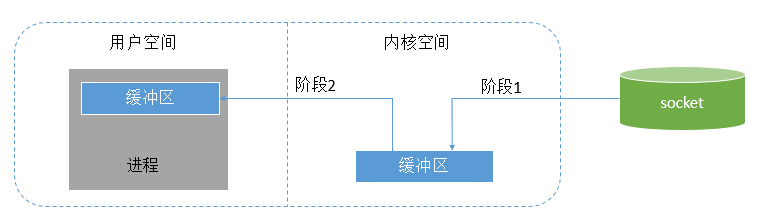
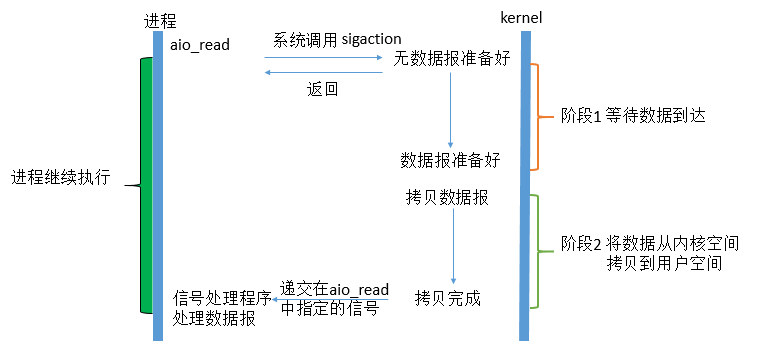

# Netty

## 1.1 Unix五种IO模型

1、阻塞式I/O：blocking IO

2、非阻塞式I/O： nonblocking IO

3、I/O复用（select，poll，epoll...）：IO multiplexing

4、信号驱动式I/O（SIGIO）：signal driven IO

5、异步I/O（POSIX的aio_系列函数）：asynchronous IO

对于这五种IO模型，Java并不是一开始就都全部支持，而是有一个逐步演进的过程：

**在JDK1.4之前**，Java的IO模型只支持阻塞式IO(Blocking IO)，简称为BIO 

**在JDK1.4时**，支持了I/O多路复用模型，相对于之前的IO模型，这是一个新的模型，所以称之为NIO（New IO），有新就有旧，所以有时也把BIO称之为OIO(old IO)，其实都是一个意思。到现在为止，JDK1.8都已经出来了，JDK1.4时引入的nio包，也没有什么新鲜的了，所以更多的人愿意把NIO理解为None-Blocking IO，即非阻塞IO。

**在JDK1.7时**，对NIO包进行了升级，支持了异步I/O(Asynchronous IO)，简称为AIO，因为是对nio包的升级，所有有时又称之为NIO2.0。

理解了Java IO模型演进与Unix五种IO模型之间的关系之后，我们对这五种模型进行详细的介绍。

在这里，我们以一个网络IO来举例，对于一个network IO (以read举例)，它会涉及到两个系统对象：一个是调用这个IO的进程，另一个就是系统内核(kernel)。当一个read操作发生时，它会经历两个阶段：

**阶段1：**等待数据准备 (Waiting for the data to be ready)

**阶段2：** 将数据从内核拷贝到进程中 (Copying the data from the kernel to the process)

如果下图所示：



图中明显忽略了很多细节，仅显示了涉及到的基本步骤 ，注意图中用户空间和内核空间的概念。

**用户空间**是常规进程所在区域。 JVM 就是常规进程，驻守于用户空间。用户空间是非特权区域：比如，在该区域执行的代码就不能直接访问硬件设备。

**内核空间**是操作系统所在区域。内核代码有特别的权力：它能与设备控制器通讯，控制着用户区域进程的运行状态，等等。最重要的是，所有 I/O 都直接（如这里所述）或间接通过内核空间。

当进程请求 I/O 操作的时候，它执行一个系统调用将控制权移交给内核。C/C++程序员所熟知的底层函数 open( )、 read( )、 write( )和 close( )要做的无非就是建立和执行适当的系统调用。当内核以这种方式被调用，它随即采取任何必要步骤，找到进程所需数据，并把数据传送到用户空间内的指定缓冲区。内核试图对数据进行高速缓存或预读取，因此进程所需数据可能已经在内核空间里了。如果是这样，该数据只需简单地拷贝出来即可。如果数据不在内核空间，则进程被挂起，内核着手把数据读进内存。

了解了这两个阶段的作用之后，我们接下来就可以深入讲解五种IO模型了，他们的区别就是在两个阶段上上有着不同的逻辑。

**1、Blocking IO**

在linux中，默认情况下所有的socket都是blocking，一个典型的读操作流程大概是这样：

第一步通常涉及等待数据从网络中到达。当所有等待数据到达时，它被复制到内核中的某个缓冲区。

第二步就是把数据从内核缓冲区复制到应用程序缓冲区。


当用户进程调用了recvfrom这个系统调用，kernel就开始了IO的第一个阶段：准备数据。对于network io来说，很多时候数据在一开始还没有到达（比如，还没有收到一个完整的UDP包），这个时候kernel就要等待足够的数据到来。而在用户进程这边，整 个进程会被阻塞。当kernel一直等到数据准备好了，它就会将数据从kernel中拷贝到用户内存，然后kernel返回结果，用户进程才解除 block的状态，重新运行起来。

**所以，blocking IO的特点就是在IO执行的两个阶段都被block了。**

**2、\**非阻塞式I/O\****

linux下，可以通过设置socket使其变为non-blocking。当对一个non-blocking socket执行读操作时，流程是这个样子：


从图中可以看出，当用户进程发出read操作时，如果kernel中的数据还没有准备好，那么它并不会block用户进程，而是立刻返回一个error。 从用户进程角度讲 ，它发起一个read操作后，并不需要等待，而是马上就得到了一个结果。用户进程判断结果是一个error时，它就知道数据还没有准备好，于是它可以再次 发送read操作。一旦kernel中的数据准备好了，并且又再次收到了用户进程的system call，那么它马上就将数据拷贝到了用户内存，然后返回。

**所以，用户进程第一个阶段不是阻塞的,需要不断的主动询问kernel数据好了没有；第二个阶段依然总是阻塞的。**

**3 \**I/O多路复用\****

IO multiplexing这个词可能有点陌生，但是如果我说select，epoll，大概就都能明白了。有些地方也称这种IO方式为event driven IO。我们都知道，select/epoll的好处就在于单个process就可以同时处理多个网络连接的IO。

IO复用同非阻塞IO本质一样，不过利用了新的select系统调用，由内核来负责本来是请求进程该做的轮询操作。看似比非阻塞IO还多了一个系统调用开销，不过因为可以支持多路IO，才算提高了效率。

它的基本原理就是select /epoll这个function会不断的轮询所负责的所有socket，当某个socket有数据到达了，就通知用户进程。它的流程如图：


当用户进程调用了`select`，那么整个进程会被block，而同时，kernel会“监视”所有select负责的socket，当任何一个 socket中的数据准备好了，select就会返回。这个时候用户进程再调用read操作，将数据从kernel拷贝到用户进程。

这个图和blocking IO的图其实并没有太大的不同，事实上，还更差一些。因为这里需要使用两个system call (select 和 recvfrom)，而blocking IO只调用了一个system call (recvfrom)。但是，用select的优势在于它可以同时处理多个connection。（多说一句。所以，如果处理的连接数不是很高的话，使用 select/epoll的web server不一定比使用multi-threading + blocking IO的web server性能更好，可能延迟还更大。

select/epoll的优势并不是对于单个连接能处理得更快，而是在于能处理更多的连接。

在IO multiplexing Model中，实际中，对于每一个socket，一般都设置成为non-blocking，但是，如上图所示，整个用户的process其实是一直被 block的。只不过process是被select这个函数block，而不是被socket IO给block。

**4 \**信号驱动式I/O\****

用的很少，就不做讲解了。直接上图


**5 异步I/O**

这类函数的工作机制是告知内核启动某个操作，并让内核在整个操作（包括将数据从内核拷贝到用户空间）完成后通知我们。如图：



用户进程发起read操作之后，立刻就可以开始去做其它的事。而另一方面，从kernel的角度，当它受到一个asynchronous read之后，首先它会立刻返回，所以不会对用户进程产生任何block。然后，kernel会等待数据准备完成，然后将数据拷贝到用户内存，当这一切都 完成之后，kernel会给用户进程发送一个signal，告诉它read操作完成了。 在这整个过程中，进程完全没有被block。


**总结：**

其实前四种I/O模型都是同步I/O操作，他们的区别在于第一阶段，而他们的第二阶段是一样的：在数据从内核复制到应用缓冲区期间（用户空间），进程阻塞于recvfrom调用。 

有人可能会说，non-blocking IO并没有被block啊。这里有个非常“狡猾”的地方，定义中所指的”IO operation”是指真实的IO操作，就是例子中的recvfrom这个system call。non-blocking IO在执行recvfrom这个system call的时候，如果kernel的数据没有准备好，这时候不会block进程。但是，当kernel中数据准备好的时候，recvfrom会将数据从 kernel拷贝到用户内存中，这个时候进程是被block了，在这段时间内，进程是被block的。


## 1.2 BIO编程与其局限性

所谓BIO编程，就是使用JDK1.4之前的api进行编程，在这里我们以ServerSocket和Socket为例进行讲解，编写一个时间服务的C/S架构应用。

 client可以发送请求指令**"GET CURRENT TIME"**给server端，每隔5秒钟发送一次，每次server端都返回当前时间。考虑到TCP编程中，不可避免的要处理粘包、解包的处理，这里为了简化，server在解包的时候，每次读取一行，认为一行就是一个请求。

 考虑到可能会有多个client同时请求server，我们针对每个client创建一个线程来进行处理，因此架构如下所示：


这实际上就是最简化的reactor线程模型，实际上netty使用也是这种模型，只不过稍微复杂了一点点。accpetor thread只负责与clieng建立连接，worker thread用于处理每个thread真正要执行的操作。

下面是代码实现

**Server端**

```java
public class TimeServer {    public static void main(String[] args) {        ServerSocket server=null;        try {            server=new ServerSocket(8080);            System.out.println("TimeServer Started on 8080...");            while (true){                Socket client = server.accept();                //每次接收到一个新的客户端连接，启动一个新的线程来处理                
new Thread(new TimeServerHandler(client)).start();            }        } catch (IOException e) {            e.printStackTrace();        }finally {            try {                server.close();            } catch (IOException e) {                e.printStackTrace();            }        }    }} public class TimeServerHandler implements Runnable {    private Socket clientProxxy;     public TimeServerHandler(Socket clientProxxy) {        this.clientProxxy = clientProxxy;    }     @Override    public void run() {        BufferedReader reader = null;        PrintWriter writer = null;        try {            reader = new BufferedReader(new InputStreamReader(clientProxxy.getInputStream()));            writer =new PrintWriter(clientProxxy.getOutputStream()) ;            while (true) {//因为一个client可以发送多次请求，这里的每一次循环，相当于接收处理一次请求                String request = reader.readLine();                if (!"GET CURRENT TIME".equals(request)) {                    writer.println("BAD_REQUEST");                } else {                    writer.println(Calendar.getInstance().getTime().toLocaleString());                }                writer.flush();            }        } catch (Exception e) {            throw new RuntimeException(e);        } finally {            try {                writer.close();                reader.close();                clientProxxy.close();            } catch (IOException e) {                e.printStackTrace();            }        }    }}
```

在这个案例中：

 我们把主(main)线程作为accpetor thread，因为我们main线程中执行了ServerSocket的accept方法，事实上，你可以认为，在哪个线程中执行了ServerSocket.accpet()，哪个线程就是accpetor thread

 针对每个client，我们都创建了一个新的Thread来处理这个client的请求，直到连接关闭，我们通过new 方法创建的线程就是worker Thread

**Client端**

```java
public class TimeClient {    public static void main(String[] args)  {        BufferedReader reader = null;        PrintWriter writer = null;        Socket client=null;        try {            client=new Socket("127.0.0.1",8080);            writer = new PrintWriter(client.getOutputStream());            reader = new BufferedReader(new InputStreamReader(client.getInputStream()));                       while (true){//每隔5秒发送一次请求                writer.println("GET CURRENT TIME");                writer.flush();                String response = reader.readLine();                System.out.println("Current Time:"+response);                Thread.sleep(5000);            }        } catch (Exception e) {            e.printStackTrace();        } finally {            try {                writer.close();                reader.close();                client.close();            } catch (IOException e) {                e.printStackTrace();            }        }     }}
```

首先运行服务端：

TimeServer Started on 8080...

接着启动客户端

Current Time:2016-12-17 22:24:51Current Time:2016-12-17 22:24:56Current Time:2016-12-17 22:25:01Current Time:2016-12-17 22:25:06...

可以看到，我们的程序已经正常工作。


**BIO编程的局限性**

 下面我们来分析上述代码的局限性，主要是server端。我们要将server端的终极目标：**"server端应该使用尽可能少的线程，来处理尽可能多的client请求"**牢记心中，这是server端优化的一个关键。

 上述代码中，针对每个client，都创建一个对应的线程来处理，如果client非常多，那么server端就要创建无数个线程来与之对应。而线程数量越多，线程上下文切换(context switch)造成的资源损耗就越大，因此我们需要使用尽可能少的线程。

 那么为什么要针对每个client都建立一个线程呢？因为BIO编程使用的是我们之前讲解的阻塞式(Blocking)I/O模型，在读取数据的时候，如果没有数据就一直等待。为了及时的响应每个client的请求，我们必须为每个client创建一个线程。例如，假设我们使用一个线程服务两个client：client A、client B，可能clientA当前没有发送请求，clientB发送了请求。如果此时线程正在读取clientA的数据，因为没有，导致线程一直处于阻塞状态，而clientB虽然有请求，但是线程因为被阻塞，也无法继续执行下去。

 因此BIO，无法满足server的终极目标，**"server端应该使用尽可能少的线程，来处理尽可能多的client请求”**。

  可能会有人想到用线程池的方式优化，此时架构如下所示：


 server不再针对每个client都创建一个新的线程，而是维护一个线程池，每次有client连接时，将其构造成一个task，交给ThreadPool处理。这样就可以最大化的复用线程。

**想法是好的，现实很残酷，因为在阻塞式I/O模型下，使用线程池本身就是一个伪命题。** 

 线程池的工作原理是，内部维护了一系列线程，接受到一个任务时，会找出一个当前空闲的线程来处理这个任务，这个任务处理完成之后，再将这个线程返回到池子中。

 而在阻塞式IO中，因为需要不断的检查一个client是否有新的请求，也就是调用其read方法，而这个方法是阻塞的，意味着，一旦调用了这个方法，如果没有读取到数据，那么这个线程就会一直block在那里，一直等到有数据，等到有了数据的时候，处理完成，立即由需要进行下一次判断，这个client有没有再次发送请求，如果没有，又block住了，因此可以认为，线程基本上是用一个少一个，因为对于一个client如果没有断开连接，就相当于这个任务没有处理完，任务没有处理完，线程永远不会返回到池子中，直到这个client断开连接。

 **在BIO中，用了线程池，意味着线程池中维护的线程数，也就是server端支持最多有多少个client来连接。**

 这里不得不提到<<netty权威指南>>的作者李林峰对读者的误导了，他的书中，2.2节，所谓的伪异步IO编程，用的就是上面这个方法。当然他对读者的误导，不止这一个地方，他在infoq发表的一篇文章，提到netty4内存池方面的问题，也是漏洞百出，我们将会之后分析到内存池的时候进行讲解。

现在我们来分析，BIO不支持server端的终极目标：**"server端应该使用尽可能少的线程，来处理尽可能多的client请求"** 的原因：

回顾我们在上一节讲解的UNIX五种IO模型中，读取数据都必须要经过的两个阶段：

阶段1、等待数据准备

阶段2、将准备好的数据从内核空间拷贝到用户空间


对于阶段1，其等待时间可能是无限长的，因为一个与server已经建立连接的client，可能很长时间内都没有发送新的请求

对于阶段2，只是将数据从内核空间拷贝到用户空间，这个时间实际上是很短的

 由于在Blocking IO模型中，进程是不区分这两个阶段的，把其当做一个整体来运行（这对应于Socket的getInputStream方法返回的InputStream 对象的read方法，这个方法不区分这两个阶段）。因此在没有数据准备好的情况下，是一直被阻塞的。而我们前面的代码， worker thread在不知道client有没有新的数据的情况下， 直接尝试去读取数据，因此线程被block住。

如果我们有一种机制，可以对这两个阶段进行区分。

 那么我们就可以用一个专门的线程去负责第一阶段：这个线程去检查有哪些client准备好了数据，然后将这些client过滤出来，交给worker线程去处理

 而worker线程只负责第二阶段：因为第一个阶段已经保证了当前处理的client肯定是有数据的，这样worker线程在读取的时候，阻塞时间是很短的，而不必经历第一阶段那样长时间的等待。

 这实际上就是我们之前提到的UNIX 五种IO模型中的多路复用模型，我们将在下一节中看到java的nio包是如何对此进行支持的。