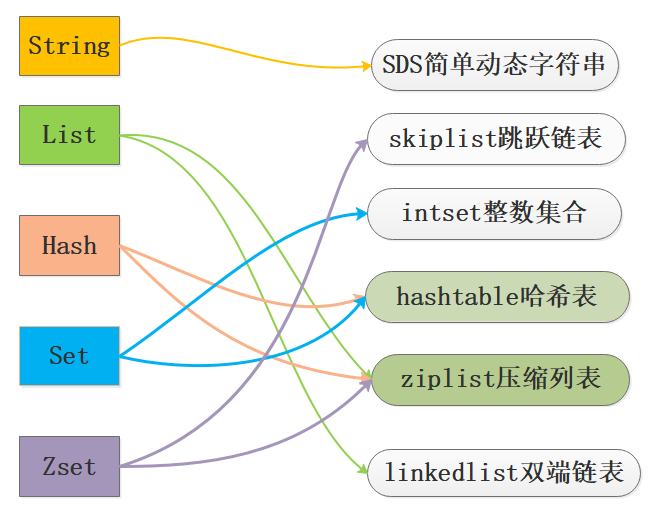
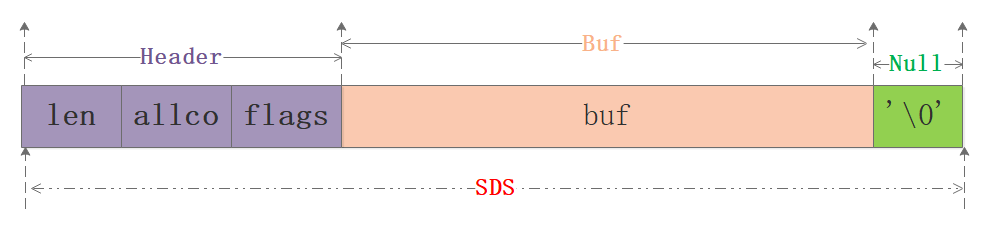
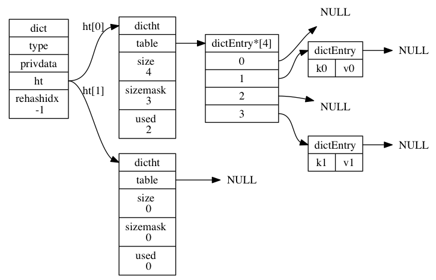

# Redis

## Redis 基础数据结构

Redis 有 5 种基础数据结构，分别为：string (字符串)、list (列表)、set (集合)、hash (哈希) 和 zset (有序集合)。

Redis底层的数据结构包括：**简单动态数组SDS、链表、字典、跳跃链表、整数集合、压缩列表、对象。**



## 0x01. Redis的SDS和C中字符串相比有什么优势？

在C语言中使用N+1长度的字符数组来表示字符串，尾部使用'\0'作为结尾标志，对于此种实现无法满足Redis对于安全性、效率、丰富的功能的要求，因此Redis单独封装了SDS简单动态字符串结构。

```c
typedef char *sds;
/*这个用不到 忽略即可*/
struct __attribute__ ((__packed__)) sdshdr5 {
    unsigned char flags; /* 3 lsb of type, and 5 msb of string length */
    char buf[];
};
/*不同长度的header 8 16 32 64共4种 都给出了四个成员
len：当前使用的空间大小；alloc去掉header和结尾空字符的最大空间大小
flags:8位的标记 下面关于SDS_TYPE_x的宏定义只有5种 3bit足够了 5bit没有用
buf:这个跟C语言中的字符数组是一样的，从typedef char* sds可以知道就是这样的。
buf的最大长度是2^n 其中n为sdshdr的类型，如当选择sdshdr16，buf_max=2^16。
*/
struct __attribute__ ((__packed__)) sdshdr8 {
    uint8_t len; /* used */
    uint8_t alloc; /* excluding the header and null terminator */
    unsigned char flags; /* 3 lsb of type, 5 unused bits */
    char buf[];
};
struct __attribute__ ((__packed__)) sdshdr16 {
    uint16_t len; /* used */
    uint16_t alloc; /* excluding the header and null terminator */
    unsigned char flags; /* 3 lsb of type, 5 unused bits */
    char buf[];
};
struct __attribute__ ((__packed__)) sdshdr32 {
    uint32_t len; /* used */
    uint32_t alloc; /* excluding the header and null terminator */
    unsigned char flags; /* 3 lsb of type, 5 unused bits */
    char buf[];
};
struct __attribute__ ((__packed__)) sdshdr64 {
    uint64_t len; /* used */
    uint64_t alloc; /* excluding the header and null terminator */
    unsigned char flags; /* 3 lsb of type, 5 unused bits */
    char buf[];
};
```



- **O(1)获取长度**: C字符串需要遍历而sds中有len可以直接获得；
- **防止缓冲区溢出bufferoverflow**: 当sds需要对字符串进行修改时，首先借助于len和alloc检查空间是否满足修改所需的要求，如果空间不够的话，SDS会自动扩展空间，避免了像C字符串操作中的覆盖情况；
- **有效降低内存分配次数**：C字符串在涉及增加或者清除操作时会改变底层数组的大小造成重新分配、sds使用了空间预分配和惰性空间释放机制，说白了就是每次在扩展时是成倍的多分配的，在缩容是也是先留着并不正式归还给OS，这两个机制也是比较好理解的；
- **二进制安全**：C语言字符串只能保存ascii码，对于图片、音频等信息无法保存，sds是二进制安全的，写入什么读取就是什么，不做任何过滤和限制；

## 0x02. Redis的字典是如何实现的？简述渐进式rehash过程

```c
//哈希节点结构
typedef struct dictEntry {
    void *key;
    union {
        void *val;
        uint64_t u64;
        int64_t s64;
        double d;
    } v;
    struct dictEntry *next;
} dictEntry;
 
//封装的是字典的操作函数指针
typedef struct dictType {
    uint64_t (*hashFunction)(const void *key);
    void *(*keyDup)(void *privdata, const void *key);
    void *(*valDup)(void *privdata, const void *obj);
    int (*keyCompare)(void *privdata, const void *key1, const void *key2);
    void (*keyDestructor)(void *privdata, void *key);
    void (*valDestructor)(void *privdata, void *obj);
} dictType;
 
/* This is our hash table structure. Every dictionary has two of this as we
 * implement incremental rehashing, for the old to the new table. */
//哈希表结构 该部分是理解字典的关键
typedef struct dictht {
    dictEntry **table;
    unsigned long size;
    unsigned long sizemask;
    unsigned long used;
} dictht;
 
//字典结构
typedef struct dict {
    dictType *type;
    void *privdata;
    dictht ht[2];
    long rehashidx; /* rehashing not in progress if rehashidx == -1 */
    unsigned long iterators; /* number of iterators currently running */
} dict;
```



**dictEntry**

dictEntry是哈希表节点，也就是我们存储数据地方，其保护的成员有：key,v,next指针。key保存着键值对中的键，v保存着键值对中的值，值可以是一个指针或者是uint64_t或者是int64_t。next是指向另一个哈希表节点的指针，这个指针可以将多个哈希值相同的键值对连接在一次，以此来解决哈希冲突的问题。

**dictht**

从源码看哈希表包括的成员有table、size、used、sizemask。table是一个数组，数组中的每个元素都是一个指向dictEntry结构的指针， 每个dictEntry结构保存着一个键值对；size 属性记录了哈希表table的大小，而used属性则记录了哈希表目前已有节点的数量。sizemask等于size-1和哈希值计算一个键在table数组的索引，也就是计算index时用到的。

**dict**

从源码中看到dict结构体就是字典的定义，包含的成员有type，privdata、ht、rehashidx。其中dictType指针类型的type指向了操作字典的api，理解为函数指针即可，ht是包含2个dictht的数组，也就是字典包含了2个哈希表，rehashidx进行rehash时使用的变量，privdata配合dictType指向的函数作为参数使用，这样就对字典的几个成员有了初步的认识。

渐进式rehashhttps://blog.csdn.net/belalds/article/details/93713491

MurmurHash算法

https://blog.csdn.net/g6U8W7p06dCO99fQ3/article/details/104489781