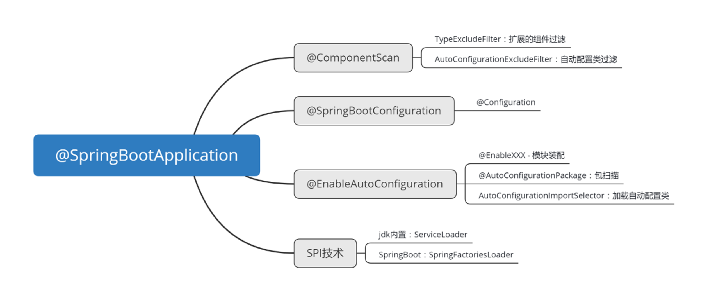

# Spring boot & Spring

## 一、SpringBoot入门程序原理概述和包扫描

启动引导部分大纲：





## 1. SpringBootApplication注解

```java
/**
 * Indicates a {@link Configuration configuration} class that declares one or more
 * {@link Bean @Bean} methods and also triggers {@link EnableAutoConfiguration
 * auto-configuration} and {@link ComponentScan component scanning}. This is a convenience
 * annotation that is equivalent to declaring {@code @Configuration},
 * {@code @EnableAutoConfiguration} and {@code @ComponentScan}.
 *
 * @author Phillip Webb
 * @author Stephane Nicoll
 * @author Andy Wilkinson
 * @since 1.2.0
 */
@Target(ElementType.TYPE)
@Retention(RetentionPolicy.RUNTIME)
@Documented
@Inherited
@SpringBootConfiguration
@EnableAutoConfiguration
@ComponentScan(excludeFilters = { @Filter(type = FilterType.CUSTOM, classes = TypeExcludeFilter.class),
		@Filter(type = FilterType.CUSTOM, classes = AutoConfigurationExcludeFilter.class) })
public @interface SpringBootApplication {}


```

指示一个配置类，该类声明一个或多个@Bean方法，并触发自动配置和组件扫描。这是一个方便的注释，相当于声明@Configuration、@EnableAutoConfiguration和@ComponentScan。

**@Inherited**

```
/**
* Indicates that an annotation type is automatically inherited. If
* an Inherited meta-annotation is present on an annotation type
* declaration, and the user queries the annotation type on a class
* declaration, and the class declaration has no annotation for this type,
* then the class's superclass will automatically be queried for the
* annotation type. This process will be repeated until an annotation for this
* type is found, or the top of the class hierarchy (Object)
* is reached. If no superclass has an annotation for this type, then
* the query will indicate that the class in question has no such annotation.
*
* <p>Note that this meta-annotation type has no effect if the annotated
* type is used to annotate anything other than a class. Note also
* that this meta-annotation only causes annotations to be inherited
* from superclasses; annotations on implemented interfaces have no
* effect.
*
* @author Joshua Bloch
* @since 1.5
* @jls 9.6.3.3 @Inherited
*/
@Documented
@Retention``(RetentionPolicy.RUNTIME)
@Target``(ElementType.ANNOTATION_TYPE)
public` `@interface` `Inherited {
}
```

1.该注解用于注解的声明上，当对某个类进行注解判定时，如果该类不存在，则会沿着类继承顺序查找父类

2.该注解不会在interface上生效

3.该注解只能用于类方法上，方法级别的注解不可以

## 2. @ComponentScan

用于类或接口上主要是指定扫描路径，spring会把指定路径下带有指定注解的类自动装配到bean容器里

```java
/**
 * @since 3.1
 */
@Retention(RetentionPolicy.RUNTIME)
@Target(ElementType.TYPE)
@Documented
@Repeatable(ComponentScans.class)
public @interface ComponentScan {

	@AliasFor("basePackages")
	String[] value() default {};
	
	@AliasFor("value")
	String[] basePackages() default {};

	Class<?>[] basePackageClasses() default {};

	Class<? extends BeanNameGenerator> nameGenerator() default BeanNameGenerator.class;

	Class<? extends ScopeMetadataResolver> scopeResolver() default AnnotationScopeMetadataResolver.class;

	ScopedProxyMode scopedProxy() default ScopedProxyMode.DEFAULT;

	String resourcePattern() default ClassPathScanningCandidateComponentProvider.DEFAULT_RESOURCE_PATTERN;

	boolean useDefaultFilters() default true;

	Filter[] includeFilters() default {};

	Filter[] excludeFilters() default {};

	/**
	 * Specify whether scanned beans should be registered for lazy initialization.
	 * @since 4.1
	 */
	boolean lazyInit() default false;
	...
}

```
basePackages、value：指定扫描路径，如果为空则以@ComponentScan注解的类所在的包为基本的扫描路径
basePackageClasses：指定具体扫描的类
includeFilters：指定满足Filter条件的类
excludeFilters：指定排除Filter条件的类

下面来看Springboot中对ComponentScan的使用

```java
@ComponentScan(excludeFilters = { 
  @Filter(type = FilterType.CUSTOM, classes = TypeExcludeFilter.class),
	@Filter(type = FilterType.CUSTOM, classes = AutoConfigurationExcludeFilter.class) })
```

### 2.1 TypeExcludeFilter

> Provides exclusion TypeFilters that are loaded from the BeanFactory and automatically applied to SpringBootApplication scanning. Can also be used directly with @ComponentScan as follows:
>
> ```java
>  @ComponentScan(excludeFilters = 
>  @Filter(type = FilterType.CUSTOM, classes = TypeExcludeFilter.class))
> ```
>
> Implementations should provide a subclass registered with BeanFactory and override the match(MetadataReader, MetadataReaderFactory) method. They should also implement a valid hashCode and equals methods so that they can be used as part of Spring test's application context caches. **Note that TypeExcludeFilters are initialized very early in the application lifecycle, they should generally not have dependencies on any other beans.** They are primarily used internally to support spring-boot-test.

在springboot中对TypeExcludeFilter进行了定义，会从BeanFactory中获取所有类型为 `TypeExcludeFilter` 的组件，去执行自定义的过滤方法。`TypeExcludeFilter` 的作用是做**扩展的组件过滤**。

### 2.2 AutoConfigurationExcludeFilter

```java
public boolean match(MetadataReader metadataReader, MetadataReaderFactory metadataReaderFactory)
        throws IOException {
    return isConfiguration(metadataReader) && isAutoConfiguration(metadataReader);
}

private boolean isConfiguration(MetadataReader metadataReader) {
    return metadataReader.getAnnotationMetadata().isAnnotated(Configuration.class.getName());
}

private boolean isAutoConfiguration(MetadataReader metadataReader) {
    return getAutoConfigurations().contains(metadataReader.getClassMetadata().getClassName());
}

protected List<String> getAutoConfigurations() {
    if (this.autoConfigurations == null) {
        this.autoConfigurations = SpringFactoriesLoader.loadFactoryNames(EnableAutoConfiguration.class,
                this.beanClassLoader);
    }
    return this.autoConfigurations;
}
```

这就是一个TypeExluder，它的 `match` 方法要判断两个部分：**是否是一个配置类，是否是一个自动配置类**。

## 3 @SpringBootConfiguration

```java
@Configuration
public @interface SpringBootConfiguration{
	@AliasFor(annotation = Configuration.class)
	boolean proxyBeanMethods() default true;
}

```

1.它被 `@Configuration` 标注，说明它实际上是标注配置类的，

2.而且是标注主启动类的。

### 3.1 @Configuration的作用

被 `@Configuration` 标注的类，会被 Spring 的IOC容器认定为配置类。

一个被 `@Configuration` 标注的类，相当于一个 `applicationContext.xml` 的配置文件。

### 3.2 @SpringBootConfiguration的附加作用

## 二、SpringBoot的核心-自动装配

### 4. SpringFramework的手动装配

在原生的 SpringFramework 中，装配组件有三种方式：

- 使用模式注解 （Spring2.5+）

  @Component标记该类为组件，@Autowired注入 这两个注解是Spring中的注解

  如果不想使用Spring的注解 等可以分别用@Named和@Inject代替上述两个注解

  @Resource 和@Inject是java规范的自动装配注解，功能等同于Spring 的@Autowired。

> 1：@Resource：默认按照组件名称进行装配，通过@Resource（name=“id”）指定注入的bean，
>
> 不支持参数required=false，不支 持  @Primary注解。
>
> **JSR250规范的实现**
>
>   2：@Autowired：默认按照组件类型进行装配，通过@Qualifier（“id”）指定注入的bean，
>
> 支持参数required=false，支持@Primary注解。
>
>  3：@Inject，依赖javax.inject,  需导入，默认按照组件类型进行装配，通过@Qualifier（“id”）指定注入的bean，
>
> 不支持参数 required=false，支持@Primary注解。
>
> **JSR330 (Dependency Injection for Java)中的规范**

- 使用配置类 `@Configuration` 与 `@Bean` （Spring3.0+）

- 使用模块装配 `@EnableXXX` 与 `@Import` （Spring3.1+）

